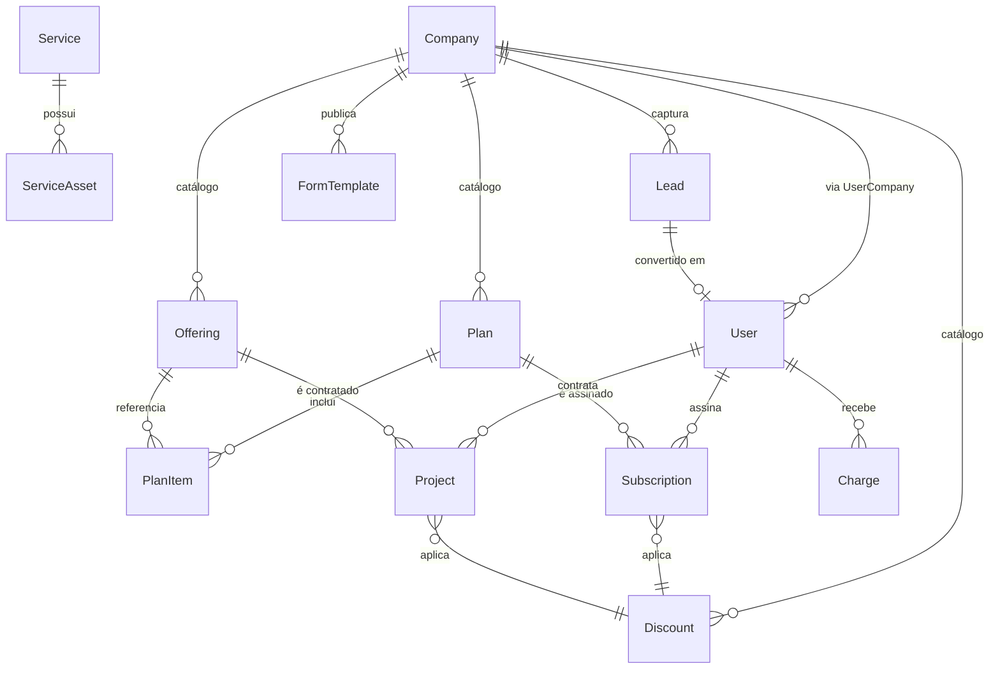

# BooPixel — Visão do Projeto

Documento único que descreve o produto BooPixel: o que é, como se ganha dinheiro, quais sistemas existem, como conversam entre si e o que cada repositório entrega.

Links úteis:
- App: https://app.boopixel.com
- Strategy: https://github.com/BooPixel/boopixel-strategy
- API: https://github.com/BooPixel/business-api
- Frontend: https://github.com/BooPixel/business-frontend

---

## 1. O que é a BooPixel

Plataforma de serviços digitais para pequenas e médias empresas, combinando:

- **Criação e manutenção de sites** (landing pages, institucionais, e-commerce, sistemas web)
- **Automação com IA** (chatbots, agentes de atendimento WhatsApp/Chat, automação de processos)
- **Marketing digital e SEO**
- **Identidade visual e branding**
- **Consultoria**

Diferencial competitivo: oferecer **site + IA + automação** como pacote integrado, posicionando acima de freelancers/fábricas de site e abaixo de agências premium. Referência: [pricing.md](https://github.com/BooPixel/boopixel-strategy/blob/master/pricing.md).

---

## 2. Modelo de negócio

### Catálogo
- **3 planos** (Starter R$ 497 / Growth R$ 1.497 / Scale R$ 3.997 por mês)
- **Serviços avulsos** com preço "a partir de" (landing page, site, e-commerce, branding, SEO, agente IA)
- **Híbrido** (setup + mensalidade)

### Descontos padronizados
- Pagamento anual (2 meses grátis — 17%)
- Bundle de serviços (10–15%)
- Indicação (1 mês grátis)
- Trial reduzido

### Estrutura jurídica
Sociedade LTDA entre dois sócios (50/50). Fluxo completo de abertura em [cnpj-ltda.md](https://github.com/BooPixel/boopixel-strategy/blob/master/cnpj-ltda.md).

---

## 3. Arquitetura

### Repositórios

| Repo | Papel | Stack |
|---|---|---|
| `boopixel-strategy` | Documentação de produto, preços, templates de formulários, decisões estratégicas | Markdown + JSON |
| `business-api` | Backend REST multi-tenant — auth, CRM, cobranças, integrações cloud, catálogo de serviços | Python 3.13, FastAPI, SQLAlchemy, MySQL, Alembic |
| `business-frontend` | SPA admin + cliente | React, React Router, Bootstrap, i18next |

### Infraestrutura

- **API**: AWS Lambda (SAM) + API Gateway HTTP, empacotada via layer (`dependencies/requirements.txt`). Deploy: `make deploy-prod`.
- **Frontend**: AWS Amplify Hosting (build automático a partir de `master`). Deploy: push ou `make frontend-prod`.
- **Banco**: MySQL gerenciado (Hostinger).
- **E-mail transacional**: SMTP da Hostinger (porta 465) para invites, notificações de lead, alertas admin.
- **Cloud integrations**: Registro.br via RDAP (domínios dos clientes); arquitetura pronta para adicionar outros providers.

### Fluxo de autenticação

- JWT com `access_token` em memória (imune a XSS via web storage)
- `refresh_token` em `localStorage` (sobrevive fechar/abrir aba/browser)
- Rehydrate no bootstrap do app via `/auth/refresh` single-flight
- Contextos: `admin` (operador da empresa) e `client` (cliente final)

---

## 4. Domínio — modelo de dados



### Conceitos principais

| Entidade | Papel |
|---|---|
| **Company** | Tenant (agência). Toda linha do sistema é escopada por `company_id`. |
| **User** | Pessoa. Pode ser admin da Company ou cliente final (`customer`). Vínculo via `UserCompany` com role. |
| **Lead** | Contato capturado via formulário público. Pode ser convertido em User. |
| **FormTemplate** | Template de formulário conversacional. JSON-driven, editável no admin. Default BooPixel + variações por campanha (evento, MVP, revisão). Strategy: [lead-capture-forms.md](https://github.com/BooPixel/boopixel-strategy/blob/master/lead-capture-forms.md). |
| **Plan** | Pacote do catálogo (Starter/Growth/Scale). Agrupa Offerings via PlanItem. |
| **Offering** | Serviço vendável individual (landing page, SEO, IA). `pricing_model` ∈ {one_time, recurring, hybrid}. |
| **Subscription** | Assinatura ativa de um cliente num Plan. Renova por `billing_cycle`. |
| **Project** | Venda avulsa amarrada a um Offering. `status` ∈ {proposal, in_progress, delivered, paid, archived}. |
| **Discount** | Regra de desconto reutilizável. `type` ∈ {percent, fixed, months_free}. |
| **Service / ServiceAsset** | Prestação de serviço ativa + ativos técnicos (domínio, hosting, credenciais cifradas). Domínios integram com Registro.br via RDAP. |
| **Charge / Transaction** | Cobranças e movimentações financeiras. |
| **CustomerEmail** | E-mails adicionais do cliente para notificação. |

---

## 5. Fluxos principais

### 5.1 Signup
Cadastro cria **User + Company** em uma operação. Convites linkam novos usuários a uma Company existente. Detalhes em [financial-system.md](https://github.com/BooPixel/boopixel-strategy/blob/master/financial-system.md).

### 5.2 Captação de lead
1. Visitante acessa `app.boopixel.com/form/<slug>`
2. Preenche o chat wizard (steps definidos em `FormTemplate` JSON)
3. `POST /api/v1/public/leads/<company_slug>` cria `Lead`
4. Admin recebe e-mail de notificação
5. Admin converte Lead → User (customer)

### 5.3 Venda
- **Pacote** → cria `Subscription(customer, plan, billing_cycle)`
- **Avulso** → cria `Project(customer, offering, setup_fee)`
- Desconto aplicado via `discount_id`

### 5.4 Cobrança recorrente
Job periódico lê `Subscription.current_period_end` e gera `Charge`. Projetos híbridos geram `Charge` de setup + `Charge` mensal de manutenção.

### 5.5 Gestão de ativos (cloud integrations)
- Cada `ServiceAsset` pode apontar pra um provider (`registro.br`, futuros)
- Action `lookup` genérica consulta dados live (status, expiração, nameservers) via RDAP
- Sincronização automática de `expires_at` quando divergir do registrador

---

## 6. Estrutura de pastas (API)

```
business-api/
├── app/
│   ├── api/v1/routers/      # endpoints REST
│   ├── cloud/               # integrações (registro.br, futuras)
│   ├── core/                # auth, email, security, settings
│   ├── db/                  # base, mixins, tipos
│   ├── models/              # SQLAlchemy
│   ├── repositories/        # acesso a dados
│   ├── schemas/             # Pydantic (request/response)
│   └── services/            # lógica de negócio
│       └── asset_actions/   # ações genéricas por asset
├── alembic/                 # migrations
├── dependencies/            # requirements.txt (Lambda layer)
└── requirements-lambda.txt  # idem
```

## 7. Estrutura de pastas (Frontend)

```
business-frontend/
├── src/
│   ├── api/                 # axios config, endpoints, services
│   ├── components/          # atoms / molecules / templates
│   ├── contexts/            # AuthContext, ThemeContext
│   ├── guards/              # ProtectedRoute, RoleProtectedRoute
│   ├── hooks/               # useRequest, useAuth, use<Entity>
│   ├── i18n/                # pt / en
│   └── pages/
│       ├── admin/           # dashboard, customers, services, leads, forms
│       └── client/          # área do cliente final
```

---

## 8. Decisões de produto já tomadas

- Multi-tenant por `company_id` em todas as tabelas
- Catálogo (Plan/Offering/Discount) **por company**, não global
- Limites de plano informativos (texto livre em `PlanItem.limit_note`), não duros
- Preço via "faixa mínima" (`Offering.price_from`), valor real negociado no `Project`
- Modelo de venda híbrido: `Subscription` (recorrente) + `Project` (one-time ou híbrido)
- Credenciais de asset cifradas simetricamente antes de persistir
- Actions de asset via registry genérico (add nova action = novo arquivo)

---

## 9. Roadmap curto

- [ ] Seed do catálogo BooPixel (3 planos + offerings padrão)
- [ ] Cálculo efetivo de desconto aplicado (percent/fixed/months_free)
- [ ] Geração automática de `Charge` a partir de `Subscription`
- [ ] UI admin de Plans/Offerings/Discounts
- [ ] Upgrade/downgrade de Subscription preservando histórico
- [ ] Integração Stripe (cobrança cartão)
- [ ] Migrar `refresh_token` para cookie `httpOnly` quando backend suportar
- [ ] Adicionar mais cloud providers (Cloudflare DNS, AWS)
- [ ] Invoices/faturas e recibos em PDF

---

## 10. Referências

- [Financial System](https://github.com/BooPixel/boopixel-strategy/blob/master/financial-system.md) — modelagem de dados, fluxo de signup, regras de negócio
- [Lead Capture Forms](https://github.com/BooPixel/boopixel-strategy/blob/master/lead-capture-forms.md) — estratégia conversacional, personas, pipeline
- [Pricing](https://github.com/BooPixel/boopixel-strategy/blob/master/pricing.md) — preços, margens, comparativo
- [CNPJ LTDA](https://github.com/BooPixel/boopixel-strategy/blob/master/cnpj-ltda.md) — abertura jurídica
- [CLAUDE.md](CLAUDE.md) — regras do projeto business-api para o Claude
