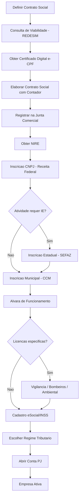

# CNPJ LTDA — BooPixel

Estrategia de abertura de CNPJ Sociedade Limitada (LTDA) para a empresa **BooPixel** entre **Mateus** e **Fernando**.

- Site: https://app.boopixel.com/
- Tipo societario: Sociedade Limitada (LTDA)
- Socios: Mateus e Fernando (50/50)

---

## Fluxo Geral

---

## Checklist

| # | Etapa | Prazo Estimado | Status |
|---|-------|----------------|--------|
| 1 | Contratar contador (CRC ativo) | 1-3 dias | |
| 2 | Definir CNAEs (atividades economicas) | 1 dia | |
| 3 | Consulta de viabilidade (nome + endereco) | 1-3 dias uteis | |
| 4 | Obter certificado digital e-CPF (cada socio) | 1-3 dias | |
| 5 | Elaborar contrato social | 1-5 dias | |
| 6 | Registro na Junta Comercial | 1-10 dias uteis | |
| 7 | Obter CNPJ (Receita Federal via REDESIM) | 1-5 dias uteis | |
| 8 | Inscricao Municipal (CCM) | 1-15 dias uteis | |
| 9 | Alvara de funcionamento | 1-30 dias uteis | |
| 10 | Cadastro eSocial | 1-5 dias uteis | |
| 11 | Definir regime tributario (Simples/Presumido/Real) | com contador | |
| 12 | Abrir conta bancaria PJ | 1-5 dias | |

**Melhor cenario (baixo risco):** 3-5 dias uteis
**Cenario realista:** 15-45 dias uteis

---

## Documentos Necessarios

### Por socio (Mateus e Fernando)

| Documento | Fernando | Mateus |
|-----------|----------|--------|
| RG ou CNH | [ ] | [ ] |
| CPF | [ ] | [ ] |
| Comprovante de residência (últimos 90 dias) | [ ] | [ ] |
| Certidão de casamento (se casado) | [ ] | [ ] |
| Última declaração IRPF | [ ] | [ ] |
| Certificado digital e-CPF (A1, ICP-Brasil) | [ ] | [ ] |

### Da empresa

| Documento | Status |
|-----------|--------|
| Contrato social (mínimo 2 vias) | [ ] |
| Comprovante de endereço da sede (IPTU ou contrato de locação) | [ ] |
| Autorização do proprietário (se imóvel alugado) | [ ] |
| Consulta prévia de viabilidade aprovada | [ ] |
| DBE (Documento Básico de Entrada) — Receita Federal | [ ] |
| Formulário de inscrição estadual/municipal | [ ] |

> **Nota:** Casados em comunhao universal de bens NAO podem ser socios entre si (Art. 977, Codigo Civil).

---

## Contrato Social — Pontos Chave

| Item | Definicao |
|------|-----------|
| Razao Social | BooPixel Tecnologia LTDA (a confirmar) |
| Nome Fantasia | BooPixel |
| Objeto Social | Desenvolvimento de software, SaaS, consultoria em TI |
| CNAEs sugeridos | 6201-5/01 (Desenvolvimento de software sob encomenda), 6203-1/00 (Desenvolvimento de software de uso nao customizavel), 6311-9/00 (Tratamento de dados) |
| Capital Social | A definir (nao ha minimo legal) |
| Divisao de Quotas | 50% Mateus / 50% Fernando |
| Administracao | Ambos os socios (ou definir) |
| Sede | Endereco a definir |
| Prazo | Indeterminado |

---

## Custos Estimados

| Item | Valor |
|------|-------|
| Registro Junta Comercial | R$ 150 - R$ 500 |
| Certificado digital e-CNPJ (A1) | R$ 150 - R$ 250 |
| Certificado digital e-CPF (A1) x2 | R$ 200 - R$ 360 |
| Taxa DARE (Junta Comercial) | ~R$ 224 |
| Alvara de funcionamento | R$ 0 - R$ 500 |
| Honorarios contabeis (abertura) | R$ 500 - R$ 2.500 |
| **Total abertura** | **R$ 1.500 - R$ 4.500** |

### Custos Recorrentes

| Item | Valor Mensal |
|------|-------------|
| Contabilidade | R$ 89 - R$ 500/mes |
| Simples Nacional (imposto) | 6% a 15.5% sobre faturamento |
| Certificado digital (renovacao anual) | R$ 150 - R$ 250/ano |

> **Contabilidade mensal e obrigatoria por lei.** Mesmo sem faturamento, a empresa tem obrigacoes mensais: declaracoes fiscais (PGDAS, DEFIS, SPED), guias de impostos (mesmo zeradas), eSocial (mesmo sem funcionarios) e balanco patrimonial anual. Se parar de entregar declaracoes, a Receita Federal pode suspender ou inativar o CNPJ.

---

## Contabilidade — Opcoes para Tech/SaaS

| Empresa | Preco/mes | Clientes | Reclame Aqui | Abertura CNPJ | Foco |
|---------|-----------|----------|-------------|----------------|------|
| [Contaja](https://contaja.com.br) | a partir de R$ 89 | 20k+ | — | Sim | Especializada em tech/SaaS |
| [Comece com o Pe Direito](https://www.comececomopedireito.com.br) | sob consulta | — | — | Sim | Especializada em SaaS/startups |
| [Agilize](https://agilize.com.br) | a partir de R$ 189 | 25k+ | 8.7, selo RA1000 | Sim, gratis | Geral, bom suporte |
| [Contabilizei](https://www.contabilizei.com.br) | a partir de R$ 195 | 100k+ | Reputacao alta | Sim, gratis | Geral, volume |

---

## Regime Tributario — Comparativo

| Regime | Faturamento Anual | Aliquota | Indicado para |
|--------|-------------------|----------|---------------|
| **Simples Nacional** | Ate R$ 4.8M | 6% a 15.5% | Startups, faturamento baixo/medio |
| **Lucro Presumido** | Ate R$ 78M | ~11.33% a 16.33% | Margens altas, poucos custos dedutiveis |
| **Lucro Real** | Sem limite | Variavel | Margens baixas, muitos custos dedutiveis |

**Recomendacao inicial:** Simples Nacional (Anexo III ou V dependendo do fator R).

---

## Como Economizar na Abertura

### Estrategias para reduzir custos

| Estrategia | Economia |
|------------|----------|
| Contador online (Contaja, Agilize) | Abertura gratis + mensalidade baixa |
| Certificado digital A1 (mais barato que A3) | ~R$ 100-180 por socio |
| Sede no endereco de um socio | Elimina aluguel |
| Atividade baixo risco (Lei 14.195/2021) | Dispensa alvara pago, abertura em ate 24h |
| Simples Nacional | Menor burocracia fiscal |

### Cenarios de custo

| Cenario | Custo abertura | Custo mensal |
|---------|---------------|--------------|
| Mais barato possivel | ~R$ 500 | ~R$ 89/mes |
| Padrao (conforme estimativas acima) | R$ 1.500 - R$ 4.500 | R$ 89 - R$ 500/mes |

### O que NAO da pra cortar

- **Contabilidade mensal** — obrigatoria por lei, mesmo sem faturamento
- **Certificado digital** — necessario para assinar documentos
- **Taxa da Junta Comercial** — ~R$ 150-224

> **Dica:** Contaja e Agilize fazem toda abertura online, sem sair de casa. So precisam do certificado digital e-CPF e definir as decisoes pendentes abaixo.

---

## Decisoes Pendentes

- [x] Razao social definitiva — **BooPixel Tecnologia LTDA**
- [ ] Endereco da sede
- [ ] Valor do capital social
- [ ] Divisao de quotas (50/50 ou outra)
- [ ] Quem sera administrador
- [ ] Escolha do contador
- [ ] CNAEs finais
- [ ] Regime tributario

---

## Links Uteis

| Recurso | URL |
|---------|-----|
| REDESIM (Portal de Abertura) | https://www.gov.br/empresas-e-negocios/pt-br/redesim |
| Receita Federal — CNPJ | https://www.gov.br/receitafederal/pt-br/assuntos/orientacao-tributaria/cadastros/cnpj |
| Portal gov.br (Abrir Empresa) | https://www.gov.br/pt-br/servicos/abrir-empresa |
| Simples Nacional | https://www8.receita.fazenda.gov.br/SimplesNacional |
| Classificacao CNAE (IBGE) | https://concla.ibge.gov.br/busca-online-cnae.html |
| eSocial | https://www.gov.br/esocial |
| Codigo Civil (Art. 1052-1087 — LTDA) | https://www.planalto.gov.br/ccivil_03/leis/2002/l10406compilada.htm |
| Lei da Liberdade Economica | https://www.planalto.gov.br/ccivil_03/_ato2019-2022/2019/lei/l13874.htm |

---

## Legislacao Relevante

- **Lei 10.406/2002** — Codigo Civil (arts. 1052 a 1087 regulam LTDA)
- **Lei 13.874/2019** — Lei da Liberdade Economica (permite LTDA unipessoal, dispensa alvara para baixo risco)
- **Lei 14.195/2021** — Melhoria do Ambiente de Negocios (abertura em ate 24h para baixo risco)
- **LC 123/2006** — Simples Nacional
- **LC 182/2021** — Marco Legal das Startups

---

## Proximos Passos

1. Alinhar decisoes pendentes entre Mateus e Fernando
2. Contratar contador
3. Iniciar consulta de viabilidade na REDESIM
4. Obter certificados digitais
5. Formalizar contrato social e registrar
