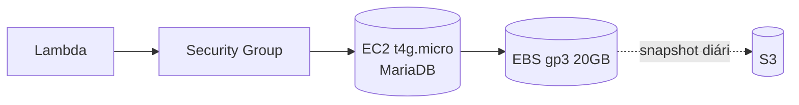

# Comparação de opções de MySQL para o BooPixel

Análise das opções de hospedagem do banco MySQL considerando custo, operação e risco. Todos os preços são estimativas em USD/mês para us-east-1.

## Resumo executivo

| Opção | Custo/mês | Managed | Cold start | Recomendado para |
|---|---|---|---|---|
| EC2 t4g.micro self-hosted | ~$6 | Não | Não | Custo mínimo, topa operar |
| Lightsail $5 plan | $5 | Parcial | Não | Simplicidade + custo baixo |
| RDS t4g.micro Single-AZ | ~$14 | Sim | Não | Produção com orçamento enxuto |
| PlanetScale Hobby | $0 | Sim | Não | Side project / MVP |
| Aurora Serverless v2 (scale-to-zero) | ~$5-44 | Sim | ~15s | Tráfego muito esporádico |
| RDS t4g.micro Multi-AZ | ~$28 | Sim | Não | Produção com SLA |

## Detalhamento

### 1. EC2 self-hosted (MariaDB/MySQL em t4g.micro)

**Custo:** ~$6/mês on-demand, ~$4 reserved 1yr.

**Prós:**
- 3-4x mais barato que RDS equivalente
- Sem cold start
- Controle total (versão, plugins, tuning)

**Contras:**
- Você gerencia: patches OS, updates MySQL, backup, monitoring
- Sem Multi-AZ automático — single point of failure
- Precisa automatizar snapshot EBS ou perde o banco num crash
- Config de VPC e security groups pra Lambda acessar

**Quando faz sentido:** custo é prioridade e você aceita operar.

---

### 2. AWS Lightsail Database

**Custo:** $5/mês fixo (512MB RAM, 20GB SSD, 1TB transfer).

**Prós:**
- Preço fixo previsível
- Backup automático incluído
- Menos fricção que EC2

**Contras:**
- RAM baixa (512MB) — só serve pra tráfego muito pequeno
- Menos integração com resto da infra AWS (VPC, IAM)
- Sem Multi-AZ no plano base

**Quando faz sentido:** MVP, projetos pessoais, tráfego baixo.

---

### 3. RDS MySQL t4g.micro

**Custo:** ~$14/mês Single-AZ, ~$28/mês Multi-AZ. + storage ~$2.30/mês (20GB gp3).

**Prós:**
- Backup automático point-in-time
- Patches automáticos
- Integração nativa com IAM, VPC, CloudWatch
- Multi-AZ failover em segundos
- Snapshot fácil

**Contras:**
- 2-3x mais caro que self-hosted
- Sem free tier após 12 meses

**Quando faz sentido:** produção de negócio real, você quer dormir tranquilo.

---

### 4. Aurora Serverless v2 com scale-to-zero

**Custo:** $0.12/ACU-hora. Com auto-pause (5min ocioso): ~$5-15/mês pra tráfego esporádico. Sem pause: ~$44/mês (0.5 ACU mínimo).

**Prós:**
- Escala automático conforme carga
- Paga só pelo que usa
- Managed completo

**Contras críticos pra Lambda:**
- **Cold start ~15s** quando DB está pausado
- Webhook do WhatsApp tem timeout ~10s — pode disparar reentrega
- API Gateway corta em 29s
- Storage $0.10/GB, I/O $0.20/milhão requests somam rápido

**Quando faz sentido:** tráfego muito previsível ou aplicação que tolera primeiro request lento.

---

### 5. PlanetScale Hobby (MySQL-compatible)

**Custo:** $0 (5GB storage, 1bi row reads/mês, 10M row writes/mês).

**Prós:**
- Grátis de verdade pra uso baixo
- Sem cold start
- Schema migrations via branches (git-like)
- Connection pooling nativo — ótimo pra Lambda

**Contras:**
- Fora da AWS — latência extra
- Não suporta foreign keys (usa Vitess)
- Se escalar além do hobby, pula pra $39/mês

**Quando faz sentido:** MVP, quer economizar enquanto valida produto.

---

## Recomendação para o BooPixel

Considerando que o BooPixel:
- Recebe webhooks do WhatsApp (timeout crítico)
- Tem Lambda em us-east-1
- É negócio gerando receita

**Ordem de preferência:**

1. **RDS t4g.micro Single-AZ (~$14/mês)** — melhor custo/risco. Backup automático, sem cold start, managed.
2. **EC2 self-hosted t4g.micro (~$6/mês)** — se quiser economizar $8/mês e topar automatizar snapshots EBS.
3. **Aurora Serverless v2 sem scale-to-zero (~$44/mês)** — só se o tráfego crescer muito e precisar escalar automaticamente.

**Evitar:**
- Aurora Serverless v2 **com** scale-to-zero → cold start quebra webhook do WhatsApp.
- Lightsail → RAM insuficiente conforme a base cresce.

## Próximos passos

Se optar por **RDS t4g.micro**, adicionar ao template SAM:
- Subnet group em VPC privada
- Security group permitindo apenas Lambda
- Parameter group com `max_connections` ajustado
- Automated backup retention 7 dias

Se optar por **EC2 self-hosted**, preparar:
- AMI base Amazon Linux 2023
- User-data instalando MariaDB
- Snapshot EBS lifecycle policy diária
- CloudWatch alarm em CPU/disco
