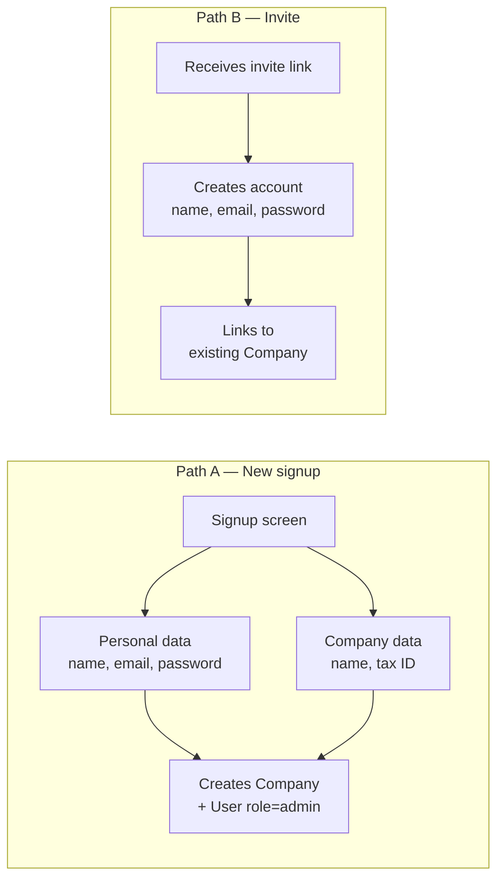
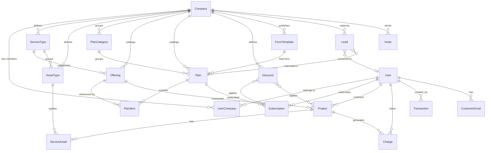
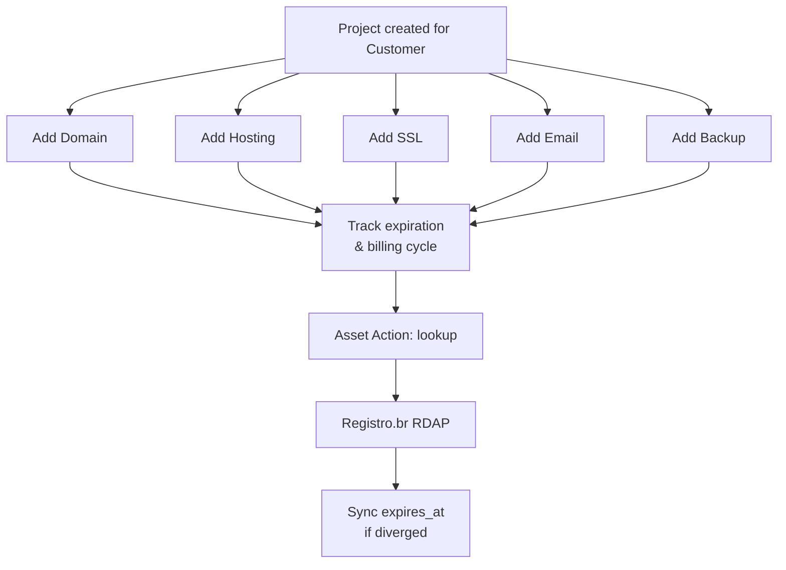

# Financial System — Modeling & Strategy

## Overview

Multi-tenant system where each user belongs to a company (via `UserCompany`) and can independently manage charges, subscriptions, projects, and financial transactions. The initial focus is serving companies that manage websites for other businesses, but the model is generic enough for any segment.

---

## Signup Flow (Strategy 1 — User + Company together)

Signup always creates a **User** and a **Company** in a single operation. Additional users join through an **invite** linked to an existing company.



**Result:** every user always belongs to a company, simplifying permissions and data scoping.

---

## Data Model

### Company

| Field      | Type         | Description                      |
|------------|--------------|----------------------------------|
| id         | INT / PK     | Unique identifier                |
| name       | VARCHAR(255) | Company name                     |
| slug       | VARCHAR(100) | URL-friendly identifier (unique) |
| document   | VARCHAR(20)  | Tax ID (CNPJ/CPF)               |
| segment    | VARCHAR(100) | Segment (e.g.: web, marketing)   |
| email      | VARCHAR(255) | Contact email                    |
| phone      | VARCHAR(20)  | Phone number                     |
| address    | TEXT         | Address                          |
| is_active  | BOOLEAN      | Active/inactive                  |
| created_at | TIMESTAMP    | Creation date                    |

### User

| Field      | Type         | Description                      |
|------------|--------------|----------------------------------|
| id         | INT / PK     | Unique identifier                |
| name       | VARCHAR(255) | Full name                        |
| email      | VARCHAR(255) | Email (unique)                   |
| password   | VARCHAR(255) | Password (hashed)                |
| is_active  | BOOLEAN      | Active/inactive                  |
| created_at | TIMESTAMP    | Creation date                    |

### UserCompany

Bridge table linking users to companies with a role.

| Field      | Type          | Description                      |
|------------|---------------|----------------------------------|
| id         | INT / PK      | Unique identifier                |
| user_id    | FK → User     | User                             |
| company_id | FK → Company  | Company                          |
| role       | ENUM          | `admin`, `operator`, `viewer`, `customer` |
| is_active  | BOOLEAN       | Active/inactive                  |
| created_at | TIMESTAMP     | Creation date                    |

> Users with `role=customer` are the company's clients. They can access the client portal (`/client/payments`).

### ServiceType

Reusable catalog of service types per company.

| Field           | Type          | Description                              |
|-----------------|---------------|------------------------------------------|
| id              | INT / PK      | Unique identifier                        |
| company_id      | FK → Company  | Owner company                            |
| name            | VARCHAR(255)  | Type name (e.g.: "Sites", "IA", "Marketing") |
| description     | TEXT          | Optional description                     |
| is_active       | BOOLEAN       | Active/inactive                          |
| created_at      | TIMESTAMP     | Creation date                            |

### AssetType

Reusable catalog of asset types per company. Linked to a ServiceType.

| Field           | Type            | Description                              |
|-----------------|-----------------|------------------------------------------|
| id              | INT / PK        | Unique identifier                        |
| company_id      | FK → Company    | Owner company                            |
| service_type_id | FK → ServiceType| Parent service type                      |
| name            | VARCHAR(255)    | Type name (e.g.: "Domain", "Hosting")    |
| description     | TEXT            | Optional description                     |
| is_active       | BOOLEAN         | Active/inactive                          |
| created_at      | TIMESTAMP       | Creation date                            |

### Offering

Individual sellable service. Has pricing model and belongs to a ServiceType.

| Field           | Type            | Description                              |
|-----------------|-----------------|------------------------------------------|
| id              | INT / PK        | Unique identifier                        |
| company_id      | FK → Company    | Owner company                            |
| service_type_id | FK → ServiceType| Category of service                      |
| slug            | VARCHAR(100)    | URL-friendly identifier                  |
| name            | VARCHAR(255)    | Display name (e.g.: "Landing Page")      |
| description     | TEXT            | Description                              |
| pricing_model   | ENUM            | `one_time`, `recurring`, `hybrid`        |
| price_from      | DECIMAL(10,2)   | Minimum price (reference)                |
| setup_fee       | DECIMAL(10,2)   | One-time setup cost                      |
| recurring_price | DECIMAL(10,2)   | Monthly recurring cost                   |
| is_active       | BOOLEAN         | Active/inactive                          |
| created_at      | TIMESTAMP       | Creation date                            |

### PlanCategory

Groups plans for display on pricing page.

| Field       | Type          | Description                              |
|-------------|---------------|------------------------------------------|
| id          | INT / PK      | Unique identifier                        |
| company_id  | FK → Company  | Owner company                            |
| slug        | VARCHAR(100)  | Identifier (e.g.: `maintenance`, `premium`, `addon`) |
| title       | VARCHAR(255)  | Display title (e.g.: "Manutencao")       |
| description | TEXT          | Section subtitle                         |
| sort_order  | INT           | Display order (lower first)              |
| is_active   | BOOLEAN       | Active/inactive                          |
| created_at  | TIMESTAMP     | Creation date                            |

### Plan

Package that groups Offerings via PlanItem.

| Field          | Type              | Description                          |
|----------------|-------------------|--------------------------------------|
| id             | INT / PK          | Unique identifier                    |
| company_id     | FK → Company      | Owner company                        |
| category_id    | FK → PlanCategory | Visual grouping (SET NULL)           |
| lead_form_id   | FK → FormTemplate | Lead form for pricing page (SET NULL)|
| slug           | VARCHAR(100)      | URL-friendly identifier              |
| name           | VARCHAR(255)      | Display name                         |
| description    | TEXT              | Plan description                     |
| tier           | INT               | Sort order within category           |
| price_monthly  | DECIMAL(10,2)     | Monthly price                        |
| price_yearly   | DECIMAL(10,2)     | Yearly price (11x monthly)           |
| trial_days     | INT               | Trial period in days                 |
| is_active      | BOOLEAN           | Active/inactive                      |
| is_featured    | BOOLEAN           | Highlighted on pricing page          |
| created_at     | TIMESTAMP         | Creation date                        |

### PlanItem

Bridge Plan × Offering.

| Field       | Type          | Description                          |
|-------------|---------------|--------------------------------------|
| id          | INT / PK      | Unique identifier                    |
| plan_id     | FK → Plan     | Parent plan                          |
| offering_id | FK → Offering | Included offering                    |
| quantity    | INT           | Quantity included                    |
| limit_note  | VARCHAR(255)  | Informational limit text             |

### Discount

Reusable discount rule.

| Field      | Type          | Description                              |
|------------|---------------|------------------------------------------|
| id         | INT / PK      | Unique identifier                        |
| company_id | FK → Company  | Owner company                            |
| name       | VARCHAR(255)  | Display name                             |
| type       | ENUM          | `percent`, `fixed`, `months_free`        |
| value      | DECIMAL(10,2) | Discount value (% or R$)                 |
| applies_to | ENUM          | `plan`, `offering`, `any`                |
| code       | VARCHAR(50)   | Optional promo code                      |
| valid_from | DATE          | Start date                               |
| valid_until| DATE          | End date                                 |
| max_uses   | INT           | Maximum redemptions                      |
| used_count | INT           | Current redemptions                      |
| min_months | INT           | Minimum commitment months                |
| is_active  | BOOLEAN       | Active/inactive                          |
| created_at | TIMESTAMP     | Creation date                            |

### Subscription

Active plan subscription for a customer.

| Field              | Type            | Description                          |
|--------------------|-----------------|--------------------------------------|
| id                 | INT / PK        | Unique identifier                    |
| company_id         | FK → Company    | Owner company                        |
| customer_id        | FK → User       | Subscribed customer                  |
| plan_id            | FK → Plan       | Subscribed plan                      |
| discount_id        | FK → Discount   | Applied discount (nullable)          |
| billing_cycle      | ENUM            | `monthly`, `yearly`                  |
| status             | ENUM            | `trialing`, `active`, `paused`, `cancelled`, `expired` |
| current_period_end | DATE            | Next billing date                    |
| started_at         | DATE            | Subscription start                   |
| cancelled_at       | DATE            | Cancellation date (nullable)         |
| created_at         | TIMESTAMP       | Creation date                        |

### Project

Individual sale (one-time, hybrid, or continuous).

| Field           | Type            | Description                          |
|-----------------|-----------------|--------------------------------------|
| id              | INT / PK        | Unique identifier                    |
| company_id      | FK → Company    | Owner company                        |
| customer_id     | FK → User       | Client                               |
| offering_id     | FK → Offering   | Linked offering                      |
| discount_id     | FK → Discount   | Applied discount (nullable)          |
| name            | VARCHAR(255)    | Project name                         |
| description     | TEXT            | Description                          |
| url             | VARCHAR(500)    | Live URL                             |
| setup_fee       | DECIMAL(10,2)   | One-time fee                         |
| recurring_price | DECIMAL(10,2)   | Monthly recurring fee                |
| status          | ENUM            | `proposal`, `in_progress`, `active`, `delivered`, `paid`, `archived` |
| started_at      | DATE            | Start date                           |
| created_at      | TIMESTAMP       | Creation date                        |

> `status=active` means ongoing project (monthly maintenance, no final delivery).

### ServiceAsset

Trackable asset tied to a Project. Linked to an AssetType.

| Field        | Type              | Description                                          |
|--------------|-------------------|------------------------------------------------------|
| id           | INT / PK          | Unique identifier                                    |
| project_id   | FK → Project      | Parent project                                       |
| company_id   | FK → Company      | Owner company (for scoping)                          |
| asset_type_id| FK → AssetType    | Type of asset                                        |
| provider     | VARCHAR(255)      | Provider name (e.g.: Registro.br, Hostinger)         |
| identifier   | VARCHAR(500)      | Main identifier (domain name, server IP, cert ID)    |
| login_url    | VARCHAR(500)      | Provider panel URL                                   |
| credentials  | TEXT, NULL         | Encrypted access info (symmetric encryption)         |
| cost         | DECIMAL(10,2)     | Cost per billing cycle                               |
| billing_cycle| ENUM              | `monthly`, `quarterly`, `yearly`                     |
| expires_at   | DATE, NULL        | Expiration date (domain renewal, SSL, hosting)       |
| auto_renew   | BOOLEAN           | Auto-renewal enabled                                 |
| status       | ENUM              | `active`, `expiring_soon`, `expired`, `cancelled`    |
| notes        | TEXT              | Additional notes                                     |
| created_at   | TIMESTAMP         | Creation date                                        |

> Credentials are encrypted symmetrically before persisting. Actions (e.g. `lookup`) are registered via a generic registry pattern.

### Charge

Individual billing entry.

| Field       | Type              | Description                              |
|-------------|-------------------|------------------------------------------|
| id          | INT / PK          | Unique identifier                        |
| company_id  | FK → Company      | Owner company                            |
| customer_id | FK → User         | Billed customer                          |
| project_id  | FK → Project, NULL| Linked project (optional)                |
| description | TEXT              | Charge description                       |
| amount      | DECIMAL(10,2)     | Amount                                   |
| due_date    | DATE              | Due date                                 |
| paid_date   | DATE, NULL        | Payment date (null = unpaid)             |
| status      | ENUM              | `pending`, `paid`, `overdue`, `cancelled`|
| created_at  | TIMESTAMP         | Creation date                            |

### Transaction

Financial entry (income and expenses).

| Field       | Type              | Description                              |
|-------------|-------------------|------------------------------------------|
| id          | INT / PK          | Unique identifier                        |
| company_id  | FK → Company      | Owner company                            |
| customer_id | FK → User, NULL   | Related customer                         |
| type        | ENUM              | `income`, `expense`                      |
| category    | VARCHAR(100)      | Category                                 |
| description | TEXT              | Entry description                        |
| amount      | DECIMAL(10,2)     | Amount                                   |
| due_date    | DATE              | Due date                                 |
| paid_at     | DATE, NULL        | Payment date (null = unpaid)             |
| status      | ENUM              | `pending`, `paid`, `overdue`, `cancelled`|
| created_by  | FK → User         | User who created the entry               |
| created_at  | TIMESTAMP         | Creation date                            |

### Lead

Contact captured via public form.

| Field            | Type              | Description                          |
|------------------|-------------------|--------------------------------------|
| id               | INT / PK          | Unique identifier                    |
| company_id       | FK → Company      | Owner company                        |
| plan_id          | FK → Plan, NULL   | Plan of interest (from pricing page) |
| converted_user_id| FK → User, NULL   | User created on conversion           |
| name             | VARCHAR(255)      | Lead name                            |
| email            | VARCHAR(255)      | Email                                |
| phone            | VARCHAR(20)       | Phone                                |
| message          | TEXT              | Additional message                   |
| source           | VARCHAR(255)      | Origin (organic, google-ads, pricing:slug) |
| status           | ENUM              | `new`, `contacted`, `qualified`, `converted`, `lost` |
| notes            | TEXT              | Internal notes                       |
| created_at       | TIMESTAMP         | Creation date                        |

### FormTemplate

JSON-driven conversational form template.

| Field      | Type          | Description                          |
|------------|---------------|--------------------------------------|
| id         | INT / PK      | Unique identifier                    |
| company_id | FK → Company  | Owner company                        |
| slug       | VARCHAR(100)  | URL identifier                       |
| name       | VARCHAR(255)  | Display name                         |
| steps      | JSON          | Form steps definition                |
| is_active  | BOOLEAN       | Published/draft                      |
| created_at | TIMESTAMP     | Creation date                        |

### CustomerEmail

Additional notification emails for a customer.

| Field      | Type          | Description                          |
|------------|---------------|--------------------------------------|
| id         | INT / PK      | Unique identifier                    |
| company_id | FK → Company  | Owner company                        |
| user_id    | FK → User     | Customer                             |
| email      | VARCHAR(255)  | Additional email                     |
| created_at | TIMESTAMP     | Creation date                        |

### Invite

Invitations for new users to join an existing company.

| Field      | Type          | Description                            |
|------------|---------------|----------------------------------------|
| id         | INT / PK      | Unique identifier                      |
| company_id | FK → Company  | Inviting company                       |
| email      | VARCHAR(255)  | Invitee email                          |
| role       | ENUM          | `admin`, `operator`, `viewer`, `customer` |
| token      | VARCHAR(255)  | Unique invite token                    |
| status     | ENUM          | `pending`, `accepted`, `expired`       |
| invited_by | FK → User     | Who sent the invite                    |
| expires_at | TIMESTAMP     | Expiration date                        |
| created_at | TIMESTAMP     | Creation date                          |

---

## Entity Relationship Diagram



---

## Service Asset Management Flow



> Asset actions use a **registry pattern** — each action is a separate file. Adding a new action = adding a new file, no existing code changes needed. Currently implemented: `lookup` via Registro.br RDAP.

---

## Transaction Categories

| Type       | Suggested categories                                                |
|------------|---------------------------------------------------------------------|
| **income** | website_subscription, development, consulting, domain, hosting      |
| **expense**| server, domain, tool, freelancer, tax                               |

---

## Business Rules

1. **Company-scoped** — every query is filtered by `company_id`. No company can see another's data.
2. **Roles (via UserCompany):**
   - `admin` — full CRUD + manage users, invites, catalog, and settings
   - `operator` — CRUD on customers, projects, charges, and transactions
   - `viewer` — read-only access
   - `customer` — client portal (view own payments via `/client/payments`)
3. **Signup** — always creates User (admin) + Company. No user exists without a company.
4. **Invite** — expires automatically after a defined period. Token is single-use. Supports all roles including `customer`.
5. **Lead capture** — public forms submit leads with duplicate guard (60-second window). Team notified by email via `BackgroundTasks`.
6. **Lead conversion** — admin converts Lead → User (customer) by creating invite or directly linking.
7. **Catalog per company** — Plan, Offering, Discount, ServiceType, AssetType are all scoped to company. Not global.
8. **Plan limits informational** — `PlanItem.limit_note` is free text, not enforced programmatically.
9. **Pricing reference** — `Offering.price_from` is a minimum reference. Actual price is negotiated on `Project`.
10. **Hybrid sales** — `Subscription` for recurring, `Project` for one-time/hybrid/continuous. `Project.status=active` = ongoing.
11. **Credentials encrypted** — `ServiceAsset.credentials` encrypted symmetrically before persisting. Never plaintext.
12. **Yearly = 11x monthly** — one month free discount for annual billing.

---

## Useful Queries

- Monthly revenue per customer
- Net profit (income - expenses) per period
- Overdue charges (status = overdue)
- Cost vs revenue per project
- Active subscriptions per plan
- Payment history per customer
- Domains expiring in next 30 days
- SSL certificates expiring soon
- Total hosting cost per customer
- Assets without auto-renew enabled
- Leads per source (ROI by channel)
- Lead conversion rate (new → converted)

---

## Usage Example

```
Company "BooPixel" (admin: Fernando)
  └─ Customer: "Caminho das Origens" (User with role=customer via UserCompany)
       └─ Subscription: Essential plan, monthly, R$ 176/mes (legado)
       └─ Project: "Site Institucional" — offering #2 — status=active
            ├─ Asset: Domain, "caminhodasorigens.com.br", Registro.br, expires 2027-03-10
            ├─ Asset: Hosting, Hostinger Cloud Startup
            ├─ Asset: SSL, Let's Encrypt, auto_renew: true
            ├─ Asset: Email, Hostinger SMTP
            ├─ Asset: Backup, Hostinger hPanel
            └─ Asset: WordPress, wp-admin
       └─ Charge: R$ 176, due 05/05, status: pending

  └─ Customer: "PSK Ambiental"
       └─ Subscription: Essential plan, monthly, R$ 161/mes (legado)
       └─ Project: "Site PSK" — offering #2 — status=active
            ├─ Asset: Domain, "pskambiental.com.br", Registro.br
            └─ ...6 assets total
       └─ Charge: R$ 161, due 05/10, status: paid

  └─ Lead: "Empresa X" — source: pricing:business:pricing-interest — plan: Business — status: new
```
