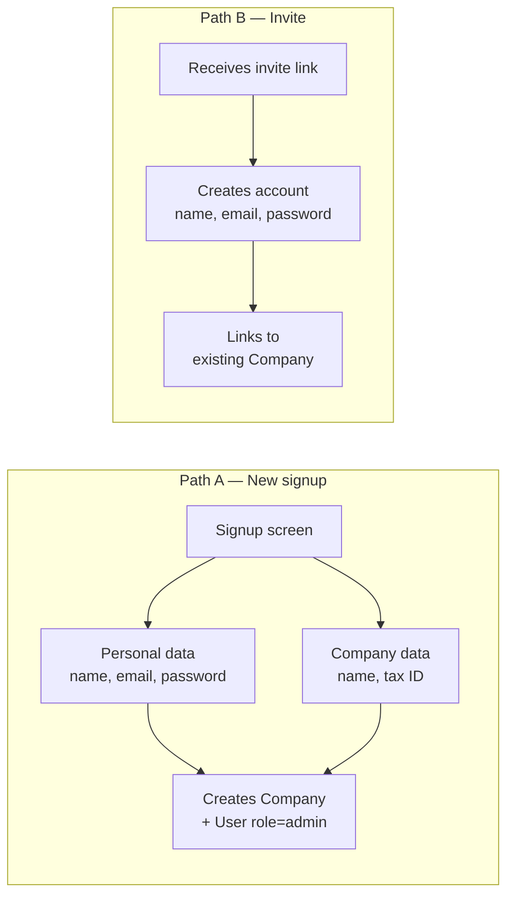
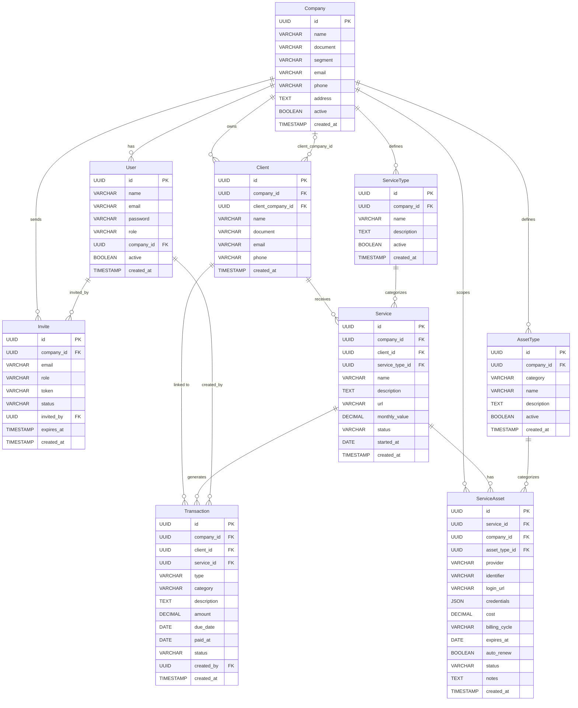
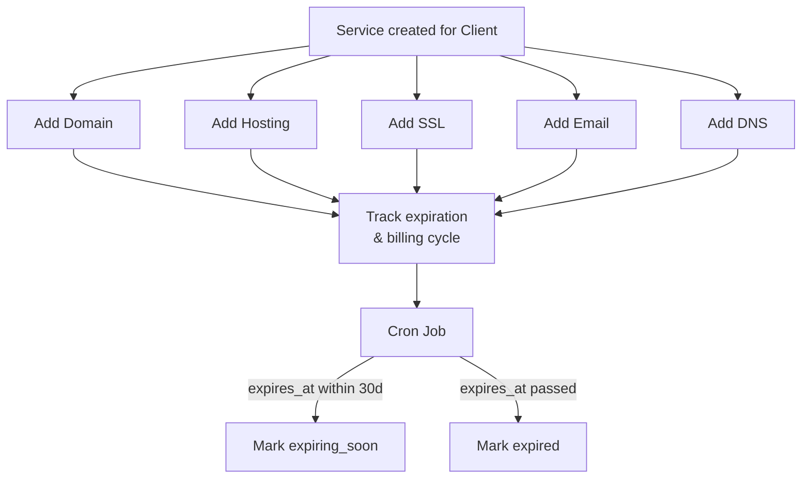

# Financial System — Modeling & Strategy

## Overview

Multi-tenant system where each user belongs to a company and can independently manage charges, income, and expenses. The initial focus is serving companies that manage websites for other businesses, but the model is generic enough for any segment.

---

## Signup Flow (Strategy 1 — User + Company together)

Signup always creates a **User** and a **Company** in a single operation. Additional users join through an **invite** linked to an existing company.



**Result:** every user always belongs to a company, simplifying permissions and data scoping.

---

## Data Model

### User

| Field      | Type         | Description                      |
|------------|--------------|----------------------------------|
| id         | UUID / PK    | Unique identifier                |
| name       | VARCHAR(255) | Full name                        |
| email      | VARCHAR(255) | Email (unique)                   |
| password   | VARCHAR(255) | Password (hashed)                |
| role       | ENUM         | `admin`, `operator`, `viewer`    |
| company_id | FK → Company | Company the user belongs to      |
| active     | BOOLEAN      | Active/inactive                  |
| created_at | TIMESTAMP    | Creation date                    |

### Company

| Field      | Type         | Description                      |
|------------|--------------|----------------------------------|
| id         | UUID / PK    | Unique identifier                |
| name       | VARCHAR(255) | Company name                     |
| document   | VARCHAR(20)  | Tax ID (CNPJ/CPF)               |
| segment    | VARCHAR(100) | Segment (e.g.: web, marketing)   |
| email      | VARCHAR(255) | Contact email                    |
| phone      | VARCHAR(20)  | Phone number                     |
| address    | TEXT         | Address                          |
| active     | BOOLEAN      | Active/inactive                  |
| created_at | TIMESTAMP    | Creation date                    |

### Client

Relationship between companies. Company A registers Company B as its client.

| Field              | Type              | Description                                        |
|--------------------|-------------------|----------------------------------------------------|
| id                 | UUID / PK         | Unique identifier                                  |
| company_id         | FK → Company      | Company that is charging (record owner)            |
| client_company_id  | FK → Company, NULL| Charged company (if also uses the system)          |
| name               | VARCHAR(255)      | Standalone name (if not a system company)          |
| document           | VARCHAR(20)       | Client tax ID                                      |
| email              | VARCHAR(255)      | Client email                                       |
| phone              | VARCHAR(20)       | Phone number                                       |
| created_at         | TIMESTAMP         | Creation date                                      |

### ServiceType

Reusable catalog of service types per company. Created once, reused across services.

| Field       | Type          | Description                                  |
|-------------|---------------|----------------------------------------------|
| id          | UUID / PK     | Unique identifier                            |
| company_id  | FK → Company  | Owner company                                |
| name        | VARCHAR(255)  | Type name (e.g.: "Institutional website")    |
| description | TEXT          | Optional description                         |
| active      | BOOLEAN       | Active/inactive                              |
| created_at  | TIMESTAMP     | Creation date                                |

### Service

Services provided to each client. Linked to a reusable ServiceType.

| Field           | Type          | Description                                  |
|-----------------|---------------|----------------------------------------------|
| id              | UUID / PK     | Unique identifier                            |
| company_id      | FK → Company  | Service provider company                     |
| client_id       | FK → Client   | Linked client                                |
| service_type_id | FK → ServiceType | Type of service                           |
| name            | VARCHAR(255)  | Service name (e.g.: "Joe's website")         |
| description     | TEXT          | Detailed description                         |
| url             | VARCHAR(500)  | Live URL (e.g.: https://joesbakery.com)      |
| monthly_value   | DECIMAL(10,2) | Monthly fee                                  |
| status          | ENUM          | `active`, `suspended`, `cancelled`           |
| started_at      | DATE          | Start date                                   |
| created_at      | TIMESTAMP     | Creation date                                |

### AssetType

Reusable catalog of asset types per company. Created once, reused across assets.

| Field       | Type          | Description                                  |
|-------------|---------------|----------------------------------------------|
| id          | UUID / PK     | Unique identifier                            |
| company_id  | FK → Company  | Owner company                                |
| category    | VARCHAR(100)  | Category grouping (see table below)          |
| name        | VARCHAR(255)  | Type name (e.g.: "Domain", "Hosting")        |
| description | TEXT          | Optional description                         |
| active      | BOOLEAN       | Active/inactive                              |
| created_at  | TIMESTAMP     | Creation date                                |

**Suggested seed data per company:**

| Category | Names |
|----------|-------|
| **Web** | Domain, Hosting, SSL, DNS, CDN |
| **Communication** | Email, Chat, Phone Line |
| **Marketing** | Ad Account, Analytics, Social Media |
| **Software** | License, SaaS, API Key |
| **Infrastructure** | Server, Database, Storage, Backup |

### ServiceAsset

Trackable assets tied to a service. Linked to a reusable AssetType.

| Field        | Type              | Description                                          |
|--------------|-------------------|------------------------------------------------------|
| id           | UUID / PK         | Unique identifier                                    |
| service_id   | FK → Service      | Parent service                                       |
| company_id   | FK → Company      | Owner company (for scoping)                          |
| asset_type_id| FK → AssetType    | Type of asset                                        |
| provider     | VARCHAR(255)      | Provider name (e.g.: GoDaddy, Cloudflare, Vercel)    |
| identifier   | VARCHAR(500)      | Main identifier (domain name, server IP, cert ID)    |
| login_url    | VARCHAR(500)      | Provider panel URL                                   |
| credentials  | JSON, NULL        | Encrypted access info (user, notes) — never plaintext passwords |
| cost         | DECIMAL(10,2)     | Cost per billing cycle                               |
| billing_cycle| ENUM              | `monthly`, `quarterly`, `yearly`                     |
| expires_at   | DATE, NULL        | Expiration date (domain renewal, SSL, hosting)       |
| auto_renew   | BOOLEAN           | Auto-renewal enabled                                 |
| status       | ENUM              | `active`, `expiring_soon`, `expired`, `cancelled`    |
| notes        | TEXT              | Additional notes                                     |
| created_at   | TIMESTAMP         | Creation date                                        |

---

### Transaction

Financial entries (income and expenses).

| Field       | Type              | Description                                  |
|-------------|-------------------|----------------------------------------------|
| id          | UUID / PK         | Unique identifier                            |
| company_id  | FK → Company      | Company that owns the transaction            |
| client_id   | FK → Client       | From/to whom                                 |
| service_id  | FK → Service, NULL| Linked service (optional)                    |
| type        | ENUM              | `income`, `expense`                          |
| category    | VARCHAR(100)      | Category (see table below)                   |
| description | TEXT              | Entry description                            |
| amount      | DECIMAL(10,2)     | Amount                                       |
| due_date    | DATE              | Due date                                     |
| paid_at     | DATE, NULL        | Payment date (null = unpaid)                 |
| status      | ENUM              | `pending`, `paid`, `overdue`, `cancelled`    |
| created_by  | FK → User         | User who created the entry                   |
| created_at  | TIMESTAMP         | Creation date                                |

### Invite

Invitations for new users to join an existing company.

| Field      | Type          | Description                                |
|------------|---------------|--------------------------------------------|
| id         | UUID / PK     | Unique identifier                          |
| company_id | FK → Company  | Inviting company                           |
| email      | VARCHAR(255)  | Invitee email                              |
| role       | ENUM          | `operator`, `viewer`                       |
| token      | VARCHAR(255)  | Unique invite token                        |
| status     | ENUM          | `pending`, `accepted`, `expired`           |
| invited_by | FK → User     | Who sent the invite                        |
| expires_at | TIMESTAMP     | Expiration date                            |
| created_at | TIMESTAMP     | Creation date                              |

---

## Entity Relationship Diagram



## Service Asset Management Flow



---

## Transaction Categories

| Type       | Suggested categories                                                |
|------------|---------------------------------------------------------------------|
| **income** | website_subscription, development, consulting, domain, hosting      |
| **expense**| server, domain, tool, freelancer, tax                               |

---

## Business Rules

1. **Company-scoped** — every query is filtered by `company_id`. No company can see another's data.
2. **Roles:**
   - `admin` — full CRUD + manage users and invites
   - `operator` — CRUD on clients, services, and transactions
   - `viewer` — read-only access
3. **Signup** — always creates User (admin) + Company. No user exists without a company.
4. **Invite** — expires automatically after a defined period. Token is single-use.
5. **Linked client** — if `client_company_id` points to another system Company, the client can (in the future) view received charges.
6. **Automatic status** — transactions past `due_date` without `paid_at` are changed to `overdue` via cron job.
7. **Asset expiration alerts** — assets with `expires_at` within 30 days are marked `expiring_soon` via cron job.
8. **Credentials** — `ServiceAsset.credentials` stores only non-sensitive info (usernames, notes). Never store plaintext passwords.

---

## Useful Queries

- Monthly revenue per client
- Net profit (income - expenses) per period
- Overdue charges (status = overdue)
- Cost vs revenue per service
- Active services per company
- Payment history per client
- Domains expiring in next 30 days
- SSL certificates expiring soon
- Total hosting cost per client
- Assets without auto-renew enabled

---

## Usage Example

```
Company "BooPixel" (admin: Fernando)
  └─ Client: "Joe's Bakery"
       └─ Service: "Institutional website" — $500/month — https://joesbakery.com
            ├─ Asset: domain, "joesbakery.com", GoDaddy, expires 2027-03-10, auto_renew: true
            ├─ Asset: hosting, "Vercel Pro", Vercel, $20/month
            ├─ Asset: ssl, "Let's Encrypt", auto_renew: true, expires 2026-07-01
            ├─ Asset: email, "contato@joesbakery.com", Google Workspace, $6/month
            └─ Transaction: income, $500, due 05/05, status: pending

  └─ Client: "Maria's Store"
       └─ Service: "E-commerce" — $1,200/month — https://mariastore.com
            ├─ Asset: domain, "mariastore.com", Cloudflare, expires 2027-01-15
            ├─ Asset: hosting, "AWS EC2 t3.medium", AWS, $50/month
            ├─ Asset: dns, "Cloudflare DNS", Cloudflare, free
            └─ Transaction: income, $1,200, due 05/10, status: paid

  └─ Transaction: expense, "AWS Server", $350, due 05/01, status: paid
  └─ Transaction: expense, "Domain joesbakery.com", $40, due 06/15, status: pending
```

If "Joe's Bakery" also uses the system:

```
Company "Joe's Bakery" (admin: Joe)
  └─ Client: "Flour Supplier Inc."
       └─ Transaction: expense, $2,000, due 05/10
```
