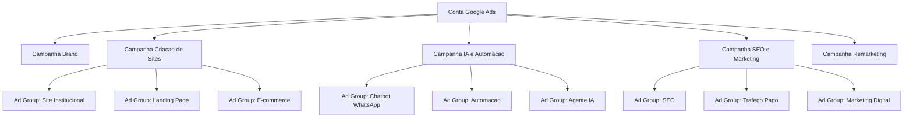
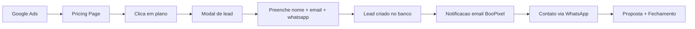

# Google Ads — Estrategia BooPixel

Estrategia de anuncios no Google Ads para captar leads e novos clientes para https://app.boopixel.com/pricing

---

## Contas e Acessos

| Servico | ID | Status |
|---------|-----|--------|
| Google Ads | 469-236-2147 | Conta criada |
| GA4 | G-XFS7Y4F884 | Configurado com Consent Mode v2 |
| GTM | (no app.boopixel.com) | Configurado |

### Vincular GA4 ↔ Google Ads

1. **GA4**: Admin → Product Links → Google Ads Links → Link → ID `469-236-2147`
2. **Google Ads**: Tools → Linked accounts → Google Analytics (GA4) → vincular propriedade

---

## Objetivo

Gerar leads qualificados para os planos da BooPixel via Google Search Ads, direcionando para a pricing page com formulario de lead integrado.

---

## Estrutura de Campanhas

---

## Campanhas Detalhadas

### 1. Brand (protecao de marca)

**Objetivo:** Proteger o nome BooPixel de concorrentes.

| Config | Valor |
|--------|-------|
| Match type | Exact |
| Budget | R$ 300/mes |
| CPC estimado | R$ 0,50 - R$ 1,00 |

**Keywords:**
- [boopixel]
- [boo pixel]
- [boopixel.com]
- [boopixel precos]

### 2. Criacao de Sites

**Objetivo:** Captar PMEs que precisam de site.

| Config | Valor |
|--------|-------|
| Match type | Phrase + Exact |
| Budget | R$ 1.500/mes |
| CPC estimado | R$ 2,00 - R$ 8,00 |

**Keywords por ad group:**

**Site Institucional:**
- "criacao de site profissional"
- "empresa que faz site"
- "criar site para empresa"
- "agencia de criacao de sites"
- "site institucional preco"
- "quanto custa criar um site"

**Landing Page:**
- "criar landing page"
- "landing page para empresa"
- "pagina de captura profissional"

**E-commerce:**
- "criar loja virtual"
- "loja virtual preco"
- "e-commerce para pequena empresa"

**Negativos:**
- gratis, free, curso, tutorial, como fazer, wordpress tema, template

### 3. IA e Automacao

**Objetivo:** Captar empresas interessadas em IA/chatbot.

| Config | Valor |
|--------|-------|
| Match type | Phrase + Exact |
| Budget | R$ 1.000/mes |
| CPC estimado | R$ 3,00 - R$ 10,00 |

**Keywords por ad group:**

**Chatbot WhatsApp:**
- "chatbot para whatsapp"
- "atendimento automatico whatsapp"
- "bot whatsapp empresa"
- "agente ia whatsapp"

**Automacao:**
- "automacao de processos empresa"
- "automacao comercial"
- "automacao atendimento"

**Agente IA:**
- "agente de ia para empresa"
- "inteligencia artificial atendimento"
- "ia para pequena empresa"

**Negativos:**
- gratis, curso, python, programacao, openai api, tutorial

### 4. SEO e Marketing Digital

**Objetivo:** Captar empresas que querem crescer online.

| Config | Valor |
|--------|-------|
| Match type | Phrase |
| Budget | R$ 700/mes |
| CPC estimado | R$ 2,00 - R$ 6,00 |

**Keywords:**
- "consultoria seo"
- "agencia de marketing digital"
- "seo para pequena empresa"
- "gestao de trafego pago"
- "aparecer no google"
- "melhorar posicionamento google"

**Negativos:**
- gratis, curso, vaga, emprego, freelancer

### 5. Remarketing (Display + Search)

**Objetivo:** Reconverter visitantes da pricing page que nao converteram.

| Config | Valor |
|--------|-------|
| Tipo | Display + RLSA |
| Budget | R$ 500/mes |
| CPC estimado | R$ 0,50 - R$ 2,00 |

**Audiencia:** Visitantes de `/pricing` ou `/planos` nos ultimos 30 dias que nao enviaram lead.

---

## Orcamento Total

| Campanha | Budget/mes | CPC estimado | Leads estimados |
|----------|-----------|-------------|----------------|
| Brand | R$ 300 | R$ 0,50 - R$ 1,00 | protecao |
| Criacao de Sites | R$ 1.500 | R$ 2,00 - R$ 8,00 | 30-50 |
| IA e Automacao | R$ 1.000 | R$ 3,00 - R$ 10,00 | 15-30 |
| SEO e Marketing | R$ 700 | R$ 2,00 - R$ 6,00 | 15-25 |
| Remarketing | R$ 500 | R$ 0,50 - R$ 2,00 | 10-20 |
| **Total** | **R$ 4.000/mes** | | **70-125 leads/mes** |

### Cenarios de investimento

| Cenario | Budget | Campanhas | Leads estimados |
|---------|--------|-----------|----------------|
| Minimo | R$ 1.500/mes | Brand + Criacao de Sites | 30-50 |
| Recomendado | R$ 4.000/mes | Todas | 70-125 |
| Agressivo | R$ 8.000/mes | Todas + mais budget | 150-250 |

---

## Anuncios — Exemplos

### Criacao de Sites

**Titulo 1:** Site Profissional para sua Empresa
**Titulo 2:** A partir de R$ 250/mes — BooPixel
**Titulo 3:** Hosting + Dominio + SSL Incluso
**Descricao:** Sites otimizados para SEO com manutencao, backup e email profissional. Planos a partir de R$ 250/mes. Fale com a gente.
**URL:** app.boopixel.com/pricing

### IA e Automacao

**Titulo 1:** Agente IA para WhatsApp
**Titulo 2:** Atendimento 24/7 Automatico
**Titulo 3:** Chatbot Inteligente — BooPixel
**Descricao:** Automatize o atendimento da sua empresa com IA. Agente WhatsApp + Chat integrado ao seu site. Planos a partir de R$ 997/mes.
**URL:** app.boopixel.com/pricing

### SEO

**Titulo 1:** Consultoria SEO Profissional
**Titulo 2:** Apareca no Google — BooPixel
**Titulo 3:** Relatorios Mensais + Resultados
**Descricao:** SEO completo para sua empresa aparecer nas primeiras posicoes do Google. Trafego organico que gera leads reais.
**URL:** app.boopixel.com/pricing

---

## Fluxo de Conversao

---

## Metricas e Metas

| Metrica | Meta |
|---------|------|
| CTR (Search) | > 5% |
| CPC medio | < R$ 5,00 |
| Conversao (lead) | > 5% dos cliques |
| CPL (Custo por Lead) | < R$ 80 |
| Leads/mes | > 70 |
| Taxa fechamento | > 10% dos leads |
| CAC (Custo Aquisicao Cliente) | < R$ 800 |
| LTV medio | R$ 1.935 - R$ 4.970/ano |
| ROAS alvo | > 3x |

---

## Tracking e Conversoes

### Google Tag Manager + GA4

| Evento | Trigger |
|--------|---------|
| `page_view_pricing` | Visita a /pricing |
| `plan_click` | Clique em "Contratar agora" (com plan_slug) |
| `lead_modal_open` | Modal de lead aberto |
| `lead_submit` | Lead enviado com sucesso (conversao principal) |

### Google Ads Conversions

| Conversao | Tipo | Valor |
|-----------|------|-------|
| Lead Submit | Primary | R$ 80 (CPL meta) |
| Pricing View | Secondary | — |
| Plan Click | Secondary | — |

---

## Extensoes de Anuncio

| Extensao | Conteudo |
|----------|---------|
| Sitelinks | Planos e Precos, Sobre Nos, Portfolio, Contato |
| Callout | Hosting Incluso, SSL Gratis, Suporte WhatsApp, Backup Automatico |
| Structured Snippets | Servicos: Sites, SEO, Chatbot IA, Landing Pages, E-commerce |
| Call | WhatsApp BooPixel |
| Price | Essential R$ 250/mes, Professional R$ 497/mes, Business R$ 1.497/mes |

---

## Cronograma

| Semana | Acao |
|--------|------|
| 1 | Criar conta Google Ads, configurar conversoes (GTM + GA4) |
| 2 | Lancar campanha Brand + Criacao de Sites |
| 3 | Lancar campanha IA e Automacao + SEO |
| 4 | Analisar dados, ajustar keywords e lances |
| 5 | Lancar Remarketing |
| 6+ | Otimizar com base em dados (pausar keywords ruins, escalar boas) |

---

## Decisoes Pendentes

- [x] Criar conta Google Ads — ID: 469-236-2147
- [x] Configurar Google Tag Manager no app.boopixel.com — GA4 (G-XFS7Y4F884) com Consent Mode v2 e cookie banner
- [x] Configurar GA4 com eventos de conversao — gtag.js carregado, consent management implementado
- [ ] Configurar eventos customizados no GA4 (page_view_pricing, plan_click, lead_modal_open, lead_submit)
- [ ] Definir budget inicial (minimo R$ 1.500 ou recomendado R$ 4.000)
- [ ] Criar anuncios responsivos (RSA) com variacoes de titulo
- [ ] Configurar remarketing pixel
- [ ] Definir responsavel por responder leads (WhatsApp)

---

## Fontes

- [Google Ads 2026 - IA e trafego pago](https://www.adlocal.com.br/blog/google-ads-2026-ia-revoluciona-trafego-pago-para-gerentes)
- [Tipos de campanha Google Ads 2026](https://www.adlocal.com.br/blog/tipo-de-campanha-google-ads-8-estrategias-essenciais-para-2026)
- [B2B SaaS PPC Strategy 2026](https://www.team4.agency/post/b2b-saas-ppc-google-ads-strategy-in-2026)
- [SaaS Google Ads Benchmarks 2026](https://www.growthspreeofficial.com/blogs/saas-google-ads-benchmarks-2026-cpc-cpl-ctr-conversion-rate-by-vertical)
- [Google Ads Benchmarks 2026 by Industry](https://www.digitalapplied.com/blog/google-ads-benchmarks-2026-cpc-ctr-cvr-industry)
- [Google Ads Guia Completo 2026](https://wizia.com.br/google-ads-2026-guia-completo-campanhas-resultados-reais/)
