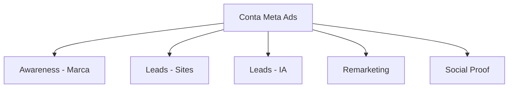
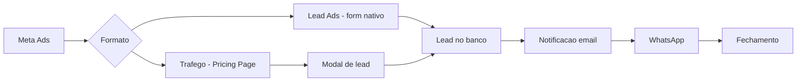

# Meta Ads — Estrategia BooPixel

Estrategia de anuncios no Facebook e Instagram para captar leads e fortalecer marca da BooPixel.

---

## Objetivo

1. **Gerar leads** qualificados para os planos via pricing page
2. **Fortalecer marca** BooPixel com conteudo de autoridade
3. **Remarketing** para visitantes que nao converteram

---

## Benchmarks Brasil 2026

| Metrica | Facebook | Instagram |
|---------|----------|-----------|
| CPC medio | R$ 0,35 - R$ 1,72 | R$ 1,83 - R$ 3,35 |
| CPM medio | R$ 0,95 - R$ 5,26 | R$ 5,00 - R$ 15,00 |
| CTR medio | 1,5% - 3% | 0,8% - 2% |
| CVR (lead ads) | ~7,72% | ~5% |
| CPL medio | R$ 15 - R$ 30 | R$ 25 - R$ 50 |

> CPM do Brasil e 70-94% abaixo do benchmark global — mercado barato pra anunciar.
> Custos Meta Ads subiram ~12,15% em 2026 (repasse PIS/Cofins/ISS).

---

## Estrutura de Campanhas



---

## Campanhas Detalhadas

### 1. Awareness — Marca BooPixel

**Objetivo:** Reconhecimento de marca + alcance.
**Plataforma:** Instagram + Facebook
**Formato:** Reels + Stories + Carrossel

| Config | Valor |
|--------|-------|
| Objetivo | Awareness / Reach |
| Budget | R$ 500/mes |
| CPM estimado | R$ 3 - R$ 8 |
| Alcance estimado | 60.000 - 160.000/mes |

**Criativos:**
- Reels curtos (15-30s) mostrando transformacao de sites (antes/depois)
- Carrossel com dicas de SEO, IA, automacao
- Stories com bastidores do desenvolvimento
- Depoimentos de clientes (video curto)

**Segmentacao:**
- Idade: 25-55
- Interesses: empreendedorismo, marketing digital, pequenas empresas, tecnologia
- Localizacao: Brasil (foco Sul + Sudeste)
- Lookalike: baseado em clientes atuais

### 2. Leads — Criacao de Sites

**Objetivo:** Gerar leads para planos de site.
**Formato:** Lead Ads + Trafego para /pricing

| Config | Valor |
|--------|-------|
| Objetivo | Lead Generation / Traffic |
| Budget | R$ 1.500/mes |
| CPC estimado | R$ 0,50 - R$ 2,00 |
| CPL estimado | R$ 15 - R$ 40 |
| Leads estimados | 37-100/mes |

**Criativos:**

**Carrossel:**
- Slide 1: "Sua empresa ainda nao tem site?"
- Slide 2: "Sites profissionais a partir de R$ 250/mes"
- Slide 3: "Dominio + SSL + Email + Backup incluso"
- Slide 4: "Veja nossos planos" (CTA)

**Video (Reels/Stories):**
- Antes e depois de site real
- Depoimento de cliente
- Tour rapido pelo admin do site

**Imagem unica:**
- Comparativo de planos (Essential vs Professional vs Advanced)
- "Quanto custa um site em 2026?" (curiosidade)

**Segmentacao:**
- Donos de negocio sem site ou com site desatualizado
- Interesses: criacao de sites, web design, Wix, WordPress, empreendedorismo
- Comportamento: admins de paginas de negocio sem site vinculado

### 3. Leads — IA e Automacao

**Objetivo:** Gerar leads para addon AI Agent.
**Formato:** Lead Ads + Trafego

| Config | Valor |
|--------|-------|
| Objetivo | Lead Generation |
| Budget | R$ 800/mes |
| CPC estimado | R$ 1,00 - R$ 3,00 |
| CPL estimado | R$ 20 - R$ 50 |
| Leads estimados | 16-40/mes |

**Criativos:**

**Video:**
- Demo do chatbot respondendo no WhatsApp (gravacao de tela)
- "Seu cliente manda mensagem as 3h da manha. Quem responde?"
- Comparativo: atendimento manual vs agente IA

**Carrossel:**
- Slide 1: "Atendimento 24/7 no WhatsApp"
- Slide 2: "Agente IA treinado com os dados da sua empresa"
- Slide 3: "Sem perder mais nenhum lead"
- Slide 4: CTA para planos

**Segmentacao:**
- Donos de negocio com volume de mensagens no WhatsApp
- Interesses: chatbot, automacao, WhatsApp Business, atendimento ao cliente
- Lookalike: leads anteriores que clicaram em IA

### 4. Remarketing

**Objetivo:** Reconverter visitantes da pricing page.

| Config | Valor |
|--------|-------|
| Objetivo | Conversions / Traffic |
| Budget | R$ 500/mes |
| CPC estimado | R$ 0,30 - R$ 1,00 |
| CPL estimado | R$ 10 - R$ 25 |
| Leads estimados | 20-50/mes |

**Audiencias:**
- Visitantes de `/pricing` nos ultimos 30 dias
- Quem abriu modal de lead mas nao enviou
- Quem interagiu com posts/anuncios nos ultimos 60 dias

**Criativos:**
- "Ainda pensando? Veja o que nossos clientes dizem"
- Oferta limitada: "Primeiro mes com 50% off"
- Urgencia: "Vagas limitadas para este mes"

### 5. Social Proof — Conteudo Organico Impulsionado

**Objetivo:** Autoridade e confianca.

| Config | Valor |
|--------|-------|
| Objetivo | Engagement |
| Budget | R$ 200/mes |
| Formato | Boost de posts organicos |

**Conteudo a impulsionar:**
- Cases de sucesso (antes/depois)
- Dicas de SEO e marketing
- Novidades sobre IA
- Bastidores da equipe

---

## Orcamento Total

| Campanha | Budget/mes | CPL estimado | Leads estimados |
|----------|-----------|-------------|----------------|
| Awareness | R$ 500 | — | alcance |
| Leads Sites | R$ 1.500 | R$ 15 - R$ 40 | 37-100 |
| Leads IA | R$ 800 | R$ 20 - R$ 50 | 16-40 |
| Remarketing | R$ 500 | R$ 10 - R$ 25 | 20-50 |
| Social Proof | R$ 200 | — | engajamento |
| **Total** | **R$ 3.500/mes** | | **73-190 leads/mes** |

### Cenarios

| Cenario | Budget | Campanhas | Leads estimados |
|---------|--------|-----------|----------------|
| Minimo | R$ 1.500/mes | Leads Sites + Remarketing | 50-100 |
| Recomendado | R$ 3.500/mes | Todas | 73-190 |
| Agressivo | R$ 7.000/mes | Todas + mais budget | 150-350 |

---

## Advantage+ (IA da Meta)

Em 2026, a Meta automatiza quase tudo via Advantage+:

- **Advantage+ Placements:** IA escolhe onde mostrar (Feed, Stories, Reels, Messenger)
- **Advantage+ Audience:** IA expande segmentacao automaticamente
- **Advantage+ Creative:** IA gera variacoes de criativos (textos, cortes, formatos)
- **Advantage+ Shopping:** Campanhas e-commerce totalmente automatizadas

**Recomendacao:** Usar Advantage+ com restricoes minimas. Fornecer 5-10 criativos variados e deixar a IA otimizar.

---

## Formatos por Plataforma

| Formato | Facebook | Instagram | Melhor para |
|---------|----------|-----------|-------------|
| Feed Image | Sim | Sim | Sites, comparativo planos |
| Carrossel | Sim | Sim | Detalhes do plano, antes/depois |
| Reels | Sim | Sim | Demo IA, transformacao site |
| Stories | Sim | Sim | Urgencia, ofertas, remarketing |
| Lead Ads | Sim | Sim | Captacao direta sem sair do app |
| Messenger | Sim | - | Atendimento, qualificacao |

---

## Fluxo de Conversao



---

## Tracking

### Meta Pixel + Conversions API

| Evento | Trigger |
|--------|---------|
| `PageView` | Qualquer pagina |
| `ViewContent` | Visita a /pricing |
| `Lead` | Lead enviado (conversao principal) |
| `Contact` | Clique em WhatsApp |

### UTMs padrao

```
utm_source=meta
utm_medium=paid
utm_campaign={campaign_name}
utm_content={ad_name}
utm_term={adset_name}
```

---

## Cronograma de Conteudo

| Semana | Criativos |
|--------|-----------|
| 1 | 3 imagens comparativo planos + 1 video antes/depois site |
| 2 | 2 carrosseis (sites + IA) + 1 depoimento cliente |
| 3 | 2 reels demo (chatbot + site) + stories remarketing |
| 4 | Analisar performance, pausar ruins, escalar bons |

**Regra:** Trocar criativos a cada 2-3 semanas pra evitar fadiga.

---

## Cronograma de Lancamento

| Semana | Acao |
|--------|------|
| 1 | Instalar Meta Pixel + Conversions API no app.boopixel.com |
| 2 | Criar Business Manager, pagina, conta de anuncios |
| 3 | Lancar Leads Sites + Awareness |
| 4 | Lancar Leads IA + Social Proof |
| 5 | Lancar Remarketing |
| 6+ | Otimizar com base em dados |

---

## Decisoes Pendentes

- [ ] Instalar Meta Pixel no app.boopixel.com
- [ ] Configurar Conversions API (server-side)
- [ ] Criar Business Manager e conta de anuncios
- [ ] Produzir criativos iniciais (imagens, videos, carrosseis)
- [ ] Definir budget inicial
- [ ] Criar audiencia Lookalike baseada em clientes atuais
- [ ] Definir responsavel por responder leads
- [ ] Conectar WhatsApp Business ao Meta

---

## Google Ads vs Meta Ads — Quando usar cada

| Criterio | Google Ads | Meta Ads |
|----------|-----------|----------|
| Intencao | Alta (usuario buscando) | Baixa (usuario navegando) |
| CPC Brasil | R$ 2 - R$ 8 | R$ 0,35 - R$ 3,35 |
| CPL Brasil | R$ 40 - R$ 80 | R$ 15 - R$ 50 |
| Melhor para | Captar quem ja quer comprar | Gerar demanda, marca, remarketing |
| Formato | Texto (Search) | Visual (imagem, video, carrossel) |
| Volume | Menor, mais qualificado | Maior, menos qualificado |

**Recomendacao:** Usar os dois juntos. Google captura demanda existente, Meta gera demanda nova.

---

## Fontes

- [Meta Ads 2026 - Custos Brasil](https://www.adlocal.com.br/blog/meta-ads-2026-revolucao-da-ia-e-novos-custos-no-brasil)
- [Meta Ads CPM/CPC Benchmarks by Country 2026](https://www.adamigo.ai/blog/meta-ads-cpm-cpc-benchmarks-by-country-2026)
- [Meta Ads Benchmarks by Objective 2026](https://www.adamigo.ai/blog/meta-ads-benchmarks-2026-by-objective-and-placement)
- [Meta Ads Conversion Rate by Industry 2026](https://www.adamigo.ai/blog/meta-ads-conversion-rate-benchmarks-industry-2026)
- [Facebook Ads CPC Brazil](https://www.superads.ai/facebook-ads-costs/cpc-cost-per-click/brazil)
- [Meta Ads Benchmarks Brazil](https://www.xyzlab.com/meta-ads-benchmarks/brazil)
- [IA Generativa no Meta Ads 2026](https://krosdigital.com.br/ia-generativa-meta-ads-2026-criativos-copywriting-escala-roas-personalizacao-eficiencia/)
- [Meta Ads vai ficar mais caro em 2026](https://www.ecommercebrasil.com.br/artigos/meta-ads-vai-ficar-mais-caro-em-2026-veja-como-evitar-perdas-na-sua-estrategia)
