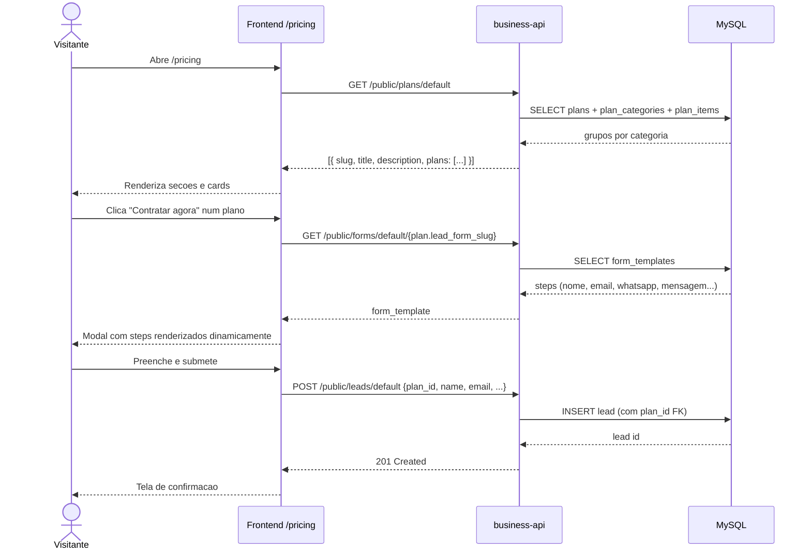
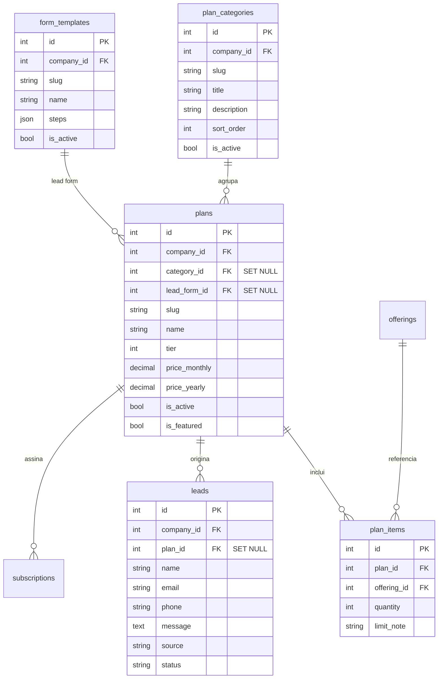

# Pagina publica de pricing — /pricing

Documenta a arquitetura da pagina publica de planos em https://app.boopixel.com/pricing (e `/planos`).

---

## Visao geral

Pagina publica (sem autenticacao) que renderiza os planos cadastrados no banco, agrupados por categoria, com toggle mensal/anual. Cada card abre um **modal de lead dinamico** cujos campos vem de um `form_template` vinculado ao plano.

Toda a configuracao vem do banco — **zero hardcode** de plano, preco, categoria, ordem ou campos de formulario.

---

## Fluxo



---

## Modelo de dados



### `plans`
Cada plano tem vinculos reais (FK, `ON DELETE SET NULL`):

| Coluna | Tipo | FK | Uso |
|---|---|---|---|
| `category_id` | INT NULL | `plan_categories.id` | Agrupamento visual e titulo/descricao da secao |
| `lead_form_id` | INT NULL | `form_templates.id` | Form usado pelo modal da pricing page |

### `plan_categories`
Tabela que rege titulo, descricao e ordem das secoes na pricing page.

| Coluna | Descricao |
|---|---|
| `slug` | Identificador unico por empresa (ex: `maintenance`, `premium`, `addon`) |
| `title` | Titulo exibido na pricing page (ex: "Manutencao") |
| `description` | Subtitulo da secao |
| `sort_order` | Ordem de aparicao (menor primeiro) |
| `is_active` | Categorias inativas nao aparecem |

Seed inicial criado via migration `cd3dca7c80cb_create_plan_categories_table`:
- `maintenance` / "Manutencao" / sort 10
- `premium` / "Projetos premium" / sort 20
- `addon` / "Adicional" / sort 30

### `form_templates`
Reutiliza a tabela que ja existia para formularios de lead. Cada `plan.lead_form_id` aponta para um template cujo `steps` JSON define os campos do modal.

Form padrao usado atualmente: `pricing-interest` (id=5), 4 steps — nome, email, whatsapp, mensagem.

### `leads`
| Coluna | Tipo | FK | Uso |
|---|---|---|---|
| `plan_id` | INT NULL | `plans.id` | Relatorios de attribution ("quantos leads do plano X") |

---

## Endpoints

### Publico (sem auth)

**`GET /api/v1/public/plans/{company_slug}`**

Retorna planos agrupados por categoria, apenas categorias com planos ativos.

```json
{
  "data": [
    {
      "slug": "maintenance",
      "title": "Manutencao",
      "description": "Para clientes que ja tem site...",
      "sort_order": 10,
      "plans": [
        {
          "id": 4,
          "slug": "essential",
          "name": "Essential",
          "tier": 1,
          "price_monthly": "161.25",
          "price_yearly": "1935.00",
          "is_featured": false,
          "category": "maintenance",
          "lead_form_slug": "pricing-interest",
          "items": [
            { "offering_id": 2, "offering_name": "Site Institucional", "quantity": 1, "limit_note": "ate 5 paginas" }
          ]
        }
      ]
    }
  ]
}
```

**`GET /api/v1/public/forms/{company_slug}/{form_slug}`**

Retorna o form_template com `steps`. Usado pelo modal para renderizar campos dinamicamente.

**`POST /api/v1/public/leads/{company_slug}`**

Payload:
```json
{
  "name": "...",
  "email": "...",
  "phone": "...",
  "message": "...",
  "source": "pricing:essential:pricing-interest",
  "plan_id": 4
}
```

### Admin (auth)

**`GET|POST|PUT|DELETE /api/v1/plan-categories/`** — CRUD de categorias.

**`GET|POST|PUT|DELETE /api/v1/plans/`** — CRUD de planos (recebe `category_id` e `lead_form_id` como inteiros).

---

## Frontend — paginas

### Publica
- [`src/pages/public/pricing/index.js`](https://github.com/BooPixel/business-frontend/blob/master/src/pages/public/pricing/index.js) — renderiza grupos, cards e toggle mensal/anual
- [`src/pages/public/pricing/LeadModal.js`](https://github.com/BooPixel/business-frontend/blob/master/src/pages/public/pricing/LeadModal.js) — modal que le o form_template e renderiza os steps como campos
- Rotas: `/pricing` e `/planos` (ambas apontam para a mesma view)
- Home service cards linkam diretamente pra `/pricing`
- Desconto anual calculado dinamicamente a partir dos precos do plano (nao hardcoded)
- Memoized computations + throttled scroll listener (performance)
- SEO: Open Graph tags, JSON-LD structured data, sitemap.xml, robots.txt
- Dominio: `app.boopixel.com` (meta tags e paginas legais atualizadas)

### Admin
- [`/catalog/plan-categories`](https://app.boopixel.com/catalog/plan-categories) — CRUD de categorias (slug, titulo, descricao, ordem, ativo)
- [`/catalog/plans`](https://app.boopixel.com/catalog/plans) — PlanForm agora tem:
  - Select de **Categoria** (carrega de `/plan-categories/`)
  - Select de **Formulario de lead** (carrega de `/forms`)
  - Ambos armazenam ID, nao slug

### Sidebar
Submenu com expand/collapse controlado por clique. Chevron gira. Grupo Planos contem "Planos" e "Categorias de planos". Grupo Servicos contem "Servicos", "Tipos de Servico", "Tipos de Ativo".

---

## Como criar um plano novo

1. **Admin** abre `/catalog/plans/new`
2. Preenche slug, nome, tier, precos
3. Seleciona categoria (ou cria uma em `/catalog/plan-categories/new` antes)
4. Seleciona form_template (ou deixa vazio — mas hoje todos apontam para `pricing-interest`)
5. Adiciona os `plan_items` (offerings incluidos)
6. Salva

Na proxima visita a `/pricing`, o plano aparece automaticamente na secao correspondente, sem deploy.

## Como criar uma categoria nova

1. Admin abre `/catalog/plan-categories/new`
2. Preenche slug (ex: `enterprise`), titulo (ex: "Enterprise"), descricao, ordem
3. Salva
4. Associa planos a essa categoria via PlanForm

Nova secao aparece em `/pricing` sem tocar em codigo.

## Como trocar o formulario de lead de um plano

1. Admin cria/edita form_template em `/forms`
2. PlanForm → seleciona o novo form em "Formulario de lead"
3. Salva

Proxima interacao na pricing page ja usa o novo form.

---

## Validacoes suportadas no modal

O `LeadModal` interpreta o `validation` de cada step do form_template:

- `min_length` — campo obrigatorio com tamanho minimo
- `email` — regex email padrao
- `phone` — contagem de digitos entre `min_digits` e `max_digits`

Steps sem `validation` viram campos opcionais. Tipos de input aceitos: `text`, `email`, `tel`, `textarea`.

---

## Migrations aplicadas (ordem)

| Revision | Descricao |
|---|---|
| `07cc991c9be0` | Adiciona coluna `plans.category` (legacy) + backfill |
| `cd3dca7c80cb` | Cria tabela `plan_categories` + seed das 3 categorias |
| `d378603ab7fd` | Adiciona `plans.lead_form_slug` (legacy) |
| `9312122e60dd` | Substitui campos string por FKs: `plans.category_id`, `plans.lead_form_id`, `leads.plan_id` — dropa colunas legadas |

---

## Otimizacoes aplicadas

### Backend
- Eager-load plan relations (fix N+1 query na rota publica)

### Frontend
- Memoize pricing computations (evita recalculo desnecessario)
- Throttle scroll listener (performance)
- Desconto anual dinamico (calculado dos precos, nao hardcoded)
- SEO completo: OG meta tags, JSON-LD (Product schema), sitemap.xml, robots.txt
- Dominio canonico: `app.boopixel.com`
- Home service cards linkam pra pricing

---

## Deploy

- **API**: `make deploy-prod` no repo `business-api` (AWS SAM)
- **Frontend**: push para `master` no repo `business-frontend` (Amplify webhook)
