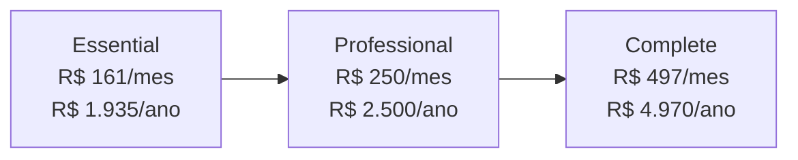
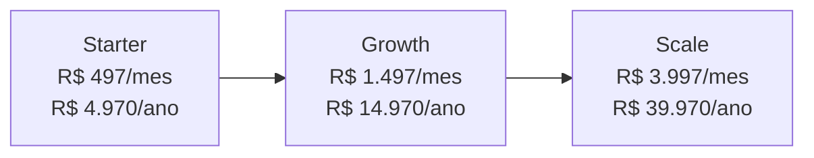
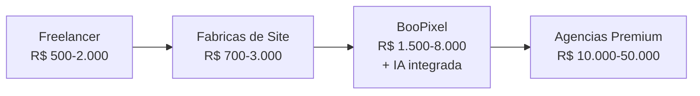

# Precificacao — BooPixel

Estrategia de precos para os servicos oferecidos pela **BooPixel** em https://app.boopixel.com/

---

## Servicos da BooPixel

1. Criacao de sites (SEO-otimizados, responsivos)
2. Automacao com IA (agentes inteligentes, processos)
3. Marketing Digital e SEO
4. Agentes de Atendimento com IA (WhatsApp + Chat)
5. Consultoria de Processos (marketing e TI)
6. Identidade Visual e Branding (logo, manual da marca)

---

## Custo de Infraestrutura (Hostinger)

| Item | Valor | Ciclo | Mensal |
|------|-------|-------|--------|
| Cloud Startup (hosting 27 sites) | R$ 1.559,88 | anual | R$ 130/mes |
| Dominio .COM.BR x2 | R$ 194,97 cada | 3 anos | ~R$ 5,42/mes cada |
| Dominio .COM x1 | R$ 140,07 | anual | ~R$ 11,67/mes |
| **Total infra** | | | **~R$ 141/mes** |
| **Custo por site** | | | **~R$ 5,22/site/mes** |

---

## Planos Ativos (cadastrados no sistema)

### Planos de Manutencao (clientes existentes)

#### Essential — R$ 161,25/mes | R$ 1.935/ano

| Item | Offering | Detalhe |
|------|----------|---------|
| Site Institucional | #2 | ate 5 paginas |
| Manutencao Webmaster | #8 | atualizacoes WP + seguranca |
| Backup | #10 | backup semanal |
| Certificado SSL | #11 | SSL incluso |
| Hospedagem | #12 | hosting compartilhado |
| Dominio | #13 | 1 dominio .com.br |
| Email Profissional | #14 | ate 3 contas |

#### Professional — R$ 250/mes | R$ 2.500/ano

| Item | Offering | Detalhe |
|------|----------|---------|
| Site Institucional | #2 | ate 5 paginas |
| Manutencao Webmaster | #8 | atualizacoes WP + seguranca |
| Backup | #10 | backup diario |
| Certificado SSL | #11 | SSL incluso |
| Hospedagem | #12 | hosting compartilhado |
| Dominio | #13 | 1 dominio .com.br |
| Email Profissional | #14 | ate 10 contas |
| Consultoria SEO | #5 | SEO on-page + relatorio mensal |

#### Complete — R$ 497/mes | R$ 4.970/ano

| Item | Offering | Detalhe |
|------|----------|---------|
| Site Institucional | #2 | ate 10 paginas |
| Manutencao Webmaster | #8 | atualizacoes WP + seguranca |
| Backup | #10 | backup diario |
| Certificado SSL | #11 | SSL incluso |
| Hospedagem | #12 | hosting compartilhado |
| Dominio | #13 | 1 dominio .com.br |
| Email Profissional | #14 | ate 10 contas |
| Consultoria SEO | #5 | SEO mensal completo + Google Analytics |
| Agente IA WhatsApp | #4 | WhatsApp + Chat |

### Planos Premium (novos clientes)

#### Starter — R$ 497/mes | R$ 4.970/ano

| Item | Offering | Detalhe |
|------|----------|---------|
| Site Institucional | #2 | ate 5 paginas |
| Landing Page | #1 | 1 LP/mes |
| Consultoria SEO | #5 | SEO basico |

#### Growth — R$ 1.497/mes | R$ 14.970/ano

| Item | Offering | Detalhe |
|------|----------|---------|
| Site Institucional | #2 | tudo do Starter |
| Landing Page | #1 | ate 2 LPs/mes |
| Agente IA WhatsApp | #4 | WhatsApp + Chat |
| Consultoria SEO | #5 | SEO mensal completo |

#### Scale — R$ 3.997/mes | R$ 39.970/ano

| Item | Offering | Detalhe |
|------|----------|---------|
| Site Institucional | #2 | tudo do Growth |
| Landing Page | #1 | ate 5 LPs/mes |
| Agente IA WhatsApp | #4 | avancado + automacoes |
| Consultoria SEO | #5 | SEO + trafego pago |
| Automacao de Processos | #7 | automacoes custom |

---

## Clientes Ativos — Plano Atual

| Cliente | Projeto | Desde | Mensal | Anual | Total Recebido | Plano |
|---------|---------|-------|--------|-------|---------------|-------|
| Caminho das Origens | Site (#2) | ago/2020 | R$ 176 | R$ 2.112 | R$ 6.312 | Essential |
| Magsinos | Site (#8) | set/2019 | R$ 173 | R$ 2.076 | R$ 7.540 | Essential |
| PSK Ambiental | Site (#11) | set/2019 | R$ 161 | R$ 1.935 | R$ 8.616 | Essential |
| Pedreira Griebeler | Site (#13) | set/2019 | R$ 161 | R$ 1.935 | R$ 7.890 | Essential |
| Preto Imoveis | Site (#15) | jun/2019 | R$ 161 | R$ 1.935 | R$ 4.764 | Essential |
| Licenca Consultoria | Site (#34) | — | R$ 0 | R$ 0 | R$ 0 | A definir |

**Receita recorrente atual (5 clientes):** ~R$ 832/mes | ~R$ 9.993/ano

---

## Margem por Plano

| Plano | Preco/mes | Custo/mes | Margem |
|-------|-----------|-----------|--------|
| Essential | R$ 161 | ~R$ 10 (infra) | **94%** |
| Professional | R$ 250 | ~R$ 15 | **94%** |
| Complete | R$ 497 | ~R$ 50 (infra + IA API) | **90%** |
| Starter | R$ 497 | ~R$ 50 | **90%** |
| Growth | R$ 1.497 | ~R$ 150 | **90%** |
| Scale | R$ 3.997 | ~R$ 400 | **90%** |

**Meta de margem bruta:** 90%+

> **Nota:** Custo por site e muito baixo (~R$ 5/mes) porque todos compartilham o mesmo plano Cloud Startup da Hostinger. A margem real depende do tempo investido em manutencao.

---

## Servicos Avulsos (offerings)

| ID | Servico | Modelo | Setup | Recorrente |
|----|---------|--------|-------|------------|
| 1 | Landing Page | unico | R$ 1.500 | — |
| 2 | Site Institucional | hibrido | R$ 3.000 | R$ 200/mes |
| 3 | E-commerce | hibrido | R$ 5.000 | R$ 300/mes |
| 4 | Agente IA WhatsApp | recorrente | — | R$ 997/mes |
| 5 | Consultoria SEO | recorrente | — | R$ 997/mes |
| 6 | Identidade Visual | unico | R$ 1.500 | — |
| 7 | Automacao de Processos | recorrente | — | R$ 1.497/mes |
| 8 | Manutencao Webmaster | recorrente | — | variavel |
| 9 | Midias Sociais | recorrente | — | variavel |
| 10 | Backup | recorrente | — | incluso nos planos |
| 11 | Certificado SSL | recorrente | — | incluso nos planos |
| 12 | Hospedagem | recorrente | — | incluso nos planos |
| 13 | Dominio | recorrente | — | incluso nos planos |
| 14 | Email Profissional | recorrente | — | incluso nos planos |

---

## Referencia de Mercado — Brasil 2026

### Criacao de Sites

| Tipo | Mercado Brasil | BooPixel Sugerido |
|------|---------------|-------------------|
| Landing Page | R$ 650 - R$ 2.000 | R$ 1.500 |
| Site Institucional | R$ 700 - R$ 10.000 | R$ 3.000 - R$ 8.000 |
| Blog / Portal de Conteudo | R$ 600 - R$ 5.000 | R$ 2.500 - R$ 5.000 |
| E-commerce / Loja Virtual | R$ 1.200 - R$ 50.000 | R$ 5.000 - R$ 15.000 |
| Sistema Web / App | R$ 2.000 - R$ 50.000+ | R$ 8.000 - R$ 30.000 |

### Automacao com IA

| Servico | Mercado Global | BooPixel Sugerido |
|---------|---------------|-------------------|
| Chatbot basico (regras) | R$ 500 - R$ 2.000/mes | R$ 497/mes |
| Agente IA (WhatsApp + Chat) | R$ 2.000 - R$ 10.000/mes | R$ 997 - R$ 2.997/mes |
| Automacao de processos | R$ 1.500 - R$ 5.000/mes | R$ 1.497 - R$ 4.997/mes |
| Consultoria IA (setup) | R$ 5.000 - R$ 30.000 (unico) | R$ 5.000 - R$ 15.000 |

### Marketing Digital e SEO

| Servico | Mercado Brasil | BooPixel Sugerido |
|---------|---------------|-------------------|
| Consultoria SEO | R$ 700 - R$ 5.000/mes | R$ 997 - R$ 2.997/mes |
| Gestao de trafego pago | R$ 1.000 - R$ 5.000/mes | R$ 1.497 - R$ 3.997/mes |
| Marketing completo (SEO + Ads) | R$ 2.000 - R$ 10.000/mes | R$ 2.997 - R$ 6.997/mes |

### Identidade Visual e Branding

| Servico | Mercado Brasil | BooPixel Sugerido |
|---------|---------------|-------------------|
| Logo | R$ 500 - R$ 5.000 | R$ 1.500 - R$ 3.000 |
| Manual da marca completo | R$ 2.000 - R$ 15.000 | R$ 3.000 - R$ 8.000 |
| Papelaria + redes sociais | R$ 1.000 - R$ 5.000 | R$ 1.500 - R$ 3.000 |

---

## Estrategia de Preco

### Posicionamento

A BooPixel se posiciona **acima de freelancers e fabricas de site**, mas **abaixo de agencias premium**. Diferencial: **IA integrada**.

### Descontos e Incentivos

| Estrategia | Desconto |
|------------|----------|
| Pagamento anual (recorrente) | 2 meses gratis (17% off) |
| Bundle (site + IA + SEO) | 10-15% off |
| Indicacao de cliente | 1 mes gratis |
| Primeiro mes | Trial com preco reduzido |

---

## Concorrencia — Comparativo

| Empresa | Site Institucional | SEO/mes | Chatbot IA | Diferencial |
|---------|-------------------|---------|------------|-------------|
| UpSites | R$ 3.000-10.000+ | R$ 700+ | Nao oferece | Volume, SEO |
| Agencia PNZ | R$ 700 | Nao divulga | Nao oferece | Preco baixo |
| Agencia Colors | R$ 500-50.000 | Variavel | Nao oferece | Range amplo |
| **BooPixel** | **R$ 3.000-8.000** | **R$ 997** | **R$ 997/mes** | **IA integrada** |

---

## Decisoes Pendentes

- [x] Definir modelo principal — pacotes + avulsos
- [x] Criar planos no sistema (Essencial, Profissional, Completo, Starter, Growth, Scale)
- [ ] Migrar 5 clientes ativos para plano Essencial (subscriptions)
- [ ] Definir preco para Licenca Consultoria
- [ ] Criar pagina de precos no app.boopixel.com
- [ ] Definir politica de reajuste anual
- [ ] Definir termos de contrato (fidelidade, cancelamento)
- [ ] Validar precos Starter/Growth/Scale com novos clientes

---

## Proximos Passos

1. Migrar clientes atuais para subscriptions do plano Essencial
2. Definir situacao de Licenca Consultoria
3. Montar pagina de precos no site
4. Oferecer upgrade para Profissional/Completo aos clientes atuais
5. Lancar planos Starter/Growth/Scale para novos clientes

---

## Fontes

- [Tabela de Precos Agencia PNZ](https://agenciapnz.com/tabela-de-precos/)
- [Quanto custa um site 2026 - Colors](https://agenciacolors.digital/quanto-custa-site/)
- [AI Agency Pricing Guide 2026](https://digitalagencynetwork.com/ai-agency-pricing/)
- [AI Chatbot Pricing 2026](https://cyfuture.ai/blog/ai-chatbot-pricing)
- [UpSites Digital](https://upsites.digital/)
