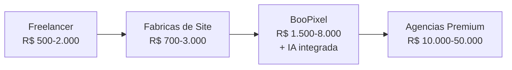

# Precificacao — BooPixel

Estrategia de precos para os servicos oferecidos pela **BooPixel** em https://app.boopixel.com/

---

## Servicos da BooPixel

1. Criacao de sites (SEO-otimizados, responsivos)
2. Automacao com IA (agentes inteligentes, processos)
3. Marketing Digital e SEO
4. Agentes de Atendimento com IA (WhatsApp + Chat)
5. Consultoria de Processos (marketing e TI)
6. Identidade Visual e Branding (logo, manual da marca)

---

## Referencia de Mercado — Brasil 2026

### Criacao de Sites

| Tipo | Mercado Brasil | BooPixel Sugerido |
|------|---------------|-------------------|
| Landing Page | R$ 650 - R$ 2.000 | R$ 1.500 |
| Site Institucional | R$ 700 - R$ 10.000 | R$ 3.000 - R$ 8.000 |
| Blog / Portal de Conteudo | R$ 600 - R$ 5.000 | R$ 2.500 - R$ 5.000 |
| E-commerce / Loja Virtual | R$ 1.200 - R$ 50.000 | R$ 5.000 - R$ 15.000 |
| Sistema Web / App | R$ 2.000 - R$ 50.000+ | R$ 8.000 - R$ 30.000 |
| Site Express (template) | R$ 95 - R$ 500/mes | R$ 197/mes |

### Automacao com IA

| Servico | Mercado Global | BooPixel Sugerido |
|---------|---------------|-------------------|
| Chatbot basico (regras) | R$ 500 - R$ 2.000/mes | R$ 497/mes |
| Agente IA (WhatsApp + Chat) | R$ 2.000 - R$ 10.000/mes | R$ 997 - R$ 2.997/mes |
| Automacao de processos | R$ 1.500 - R$ 5.000/mes | R$ 1.497 - R$ 4.997/mes |
| Consultoria IA (setup) | R$ 5.000 - R$ 30.000 (unico) | R$ 5.000 - R$ 15.000 |

### Marketing Digital e SEO

| Servico | Mercado Brasil | BooPixel Sugerido |
|---------|---------------|-------------------|
| Consultoria SEO | R$ 700 - R$ 5.000/mes | R$ 997 - R$ 2.997/mes |
| Gestao de trafego pago | R$ 1.000 - R$ 5.000/mes | R$ 1.497 - R$ 3.997/mes |
| Marketing completo (SEO + Ads) | R$ 2.000 - R$ 10.000/mes | R$ 2.997 - R$ 6.997/mes |

### Identidade Visual e Branding

| Servico | Mercado Brasil | BooPixel Sugerido |
|---------|---------------|-------------------|
| Logo | R$ 500 - R$ 5.000 | R$ 1.500 - R$ 3.000 |
| Manual da marca completo | R$ 2.000 - R$ 15.000 | R$ 3.000 - R$ 8.000 |
| Papelaria + redes sociais | R$ 1.000 - R$ 5.000 | R$ 1.500 - R$ 3.000 |

---

## Modelo de Precificacao Sugerido

### Opcao A — Pacotes (recomendado para escalar)

```
┌─────────────────────────────────────────────────────────────┐
│  STARTER          │  GROWTH           │  SCALE              │
│  R$ 497/mes       │  R$ 1.497/mes     │  R$ 3.997/mes       │
├───────────────────┼───────────────────┼─────────────────────┤
│  Site institucional│  Tudo do Starter  │  Tudo do Growth     │
│  1 Landing Page   │  Agente IA basico │  Agente IA avancado │
│  SSL + Hosting    │  WhatsApp bot     │  Automacoes custom  │
│  SEO on-page      │  SEO mensal       │  SEO + Trafego pago │
│  Suporte email    │  Suporte WhatsApp │  Suporte prioritario│
│                   │  Relatorios       │  Consultoria mensal │
└───────────────────┴───────────────────┴─────────────────────┘
```

### Opcao B — Servicos Avulsos

| Servico | Preco |
|---------|-------|
| Criacao de site institucional | a partir de R$ 3.000 |
| Landing Page | R$ 1.500 |
| E-commerce | a partir de R$ 5.000 |
| Agente IA (WhatsApp + Chat) | R$ 997/mes |
| Consultoria SEO | R$ 997/mes |
| Identidade Visual | a partir de R$ 1.500 |
| Automacao de processos | a partir de R$ 1.497/mes |

### Opcao C — Hibrido (setup + recorrente)

| Fase | Modelo |
|------|--------|
| Setup (site + branding + config IA) | Pagamento unico ou parcelado |
| Recorrente (manutencao + IA + SEO) | Assinatura mensal |

**Exemplo:**
- Setup: R$ 5.000 (3x de R$ 1.667)
- Mensal: R$ 997/mes (agente IA + manutencao + SEO basico)

---

## Estrategia de Preco

### Posicionamento

A BooPixel deve se posicionar **acima de freelancers e fabricas de site**, mas **abaixo de agencias premium**. O diferencial e a **IA integrada** — algo que agencias tradicionais nao oferecem.



### Margem Alvo

| Servico | Custo estimado | Preco | Margem |
|---------|---------------|-------|--------|
| Site institucional | ~R$ 800-1.500 (tempo) | R$ 3.000-8.000 | 60-80% |
| Agente IA mensal | ~R$ 200-400 (infra + API) | R$ 997/mes | 60-80% |
| SEO mensal | ~R$ 300-500 (tempo) | R$ 997/mes | 50-70% |
| Branding | ~R$ 500-1.000 (tempo) | R$ 1.500-3.000 | 50-70% |

**Meta de margem bruta:** 60-75%

### Descontos e Incentivos

| Estrategia | Desconto |
|------------|----------|
| Pagamento anual (recorrente) | 2 meses gratis (17% off) |
| Bundle (site + IA + SEO) | 10-15% off |
| Indicacao de cliente | 1 mes gratis |
| Primeiro mes | Trial com preco reduzido |

---

## Concorrencia — Comparativo

| Empresa | Site Institucional | SEO/mes | Chatbot IA | Diferencial |
|---------|-------------------|---------|------------|-------------|
| UpSites | R$ 3.000-10.000+ | R$ 700+ | Nao oferece | Volume, SEO |
| Agencia PNZ | R$ 700 | Nao divulga | Nao oferece | Preco baixo |
| Agencia Colors | R$ 500-50.000 | Variavel | Nao oferece | Range amplo |
| **BooPixel** | **R$ 3.000-8.000** | **R$ 997** | **R$ 997/mes** | **IA integrada** |

O diferencial competitivo da BooPixel e oferecer **site + IA + automacao** como pacote unico. Nenhum concorrente direto no Brasil oferece isso de forma integrada no mesmo nivel de preco.

---

## Decisoes Pendentes

- [ ] Definir modelo principal (pacotes vs avulso vs hibrido)
- [ ] Validar precos com primeiros clientes (5-10 projetos)
- [ ] Definir custos reais de infra IA (OpenAI API, hosting, etc.)
- [ ] Criar pagina de precos no app.boopixel.com
- [ ] Definir politica de reajuste anual
- [ ] Definir termos de contrato (fidelidade, cancelamento)
- [ ] Testar preco do agente IA no mercado

---

## Proximos Passos

1. Validar custos internos (tempo + infra) por servico
2. Escolher modelo de precificacao
3. Montar pagina de precos no site
4. Testar com 5 clientes piloto
5. Ajustar precos com base no feedback

---

## Fontes

- [Tabela de Precos Agencia PNZ](https://agenciapnz.com/tabela-de-precos/)
- [Quanto custa um site 2026 - Colors](https://agenciacolors.digital/quanto-custa-site/)
- [AI Agency Pricing Guide 2026](https://digitalagencynetwork.com/ai-agency-pricing/)
- [AI Chatbot Pricing 2026](https://cyfuture.ai/blog/ai-chatbot-pricing)
- [UpSites Digital](https://upsites.digital/)
