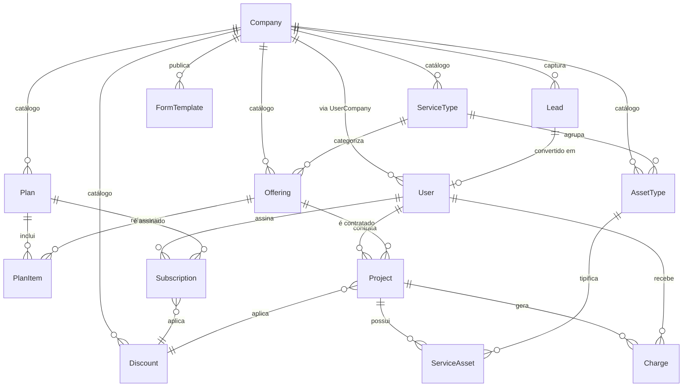

# BooPixel — Visão do Projeto

Documento único que descreve o produto BooPixel: o que é, como se ganha dinheiro, quais sistemas existem, como conversam entre si e o que cada repositório entrega.

Links úteis:
- App: https://app.boopixel.com
- Strategy: https://github.com/BooPixel/boopixel-strategy
- API: https://github.com/BooPixel/business-api
- Frontend: https://github.com/BooPixel/business-frontend

---

## 1. O que é a BooPixel

Plataforma de serviços digitais para pequenas e médias empresas, combinando:

- **Criação e manutenção de sites** (landing pages, institucionais, e-commerce, sistemas web)
- **Automação com IA** (chatbots, agentes de atendimento WhatsApp/Chat, automação de processos)
- **Marketing digital e SEO**
- **Identidade visual e branding**
- **Consultoria**

Diferencial competitivo: oferecer **site + IA + automação** como pacote integrado, posicionando acima de freelancers/fábricas de site e abaixo de agências premium. Referência: [pricing.md](https://github.com/BooPixel/boopixel-strategy/blob/master/pricing.md).

---

## 2. Modelo de negócio

### Catálogo (implementado)
- **8 planos** em 3 categorias:
  - Maintenance: Essential (R$ 250/mes) · Professional (R$ 497/mes) · Advanced (R$ 797/mes)
  - Premium: Business (R$ 1.497/mes) · Growth (R$ 2.497/mes) · Enterprise (R$ 3.997/mes)
  - Addon: AI Agent (R$ 997/mes) · Automation (R$ 1.497/mes)
- **13 offerings** ativos (landing-page, site-institucional, e-commerce, agente-ia, seo-mensal, branding, automacao, webmaster, midias-sociais, backup, ssl, dominio, email-profissional)
- **3 plan_categories** (maintenance, premium, addon) com pricing page publica
- **Tipos de servico** (ServiceType) — categoria editavel
- **4 descontos** padrao: ANUAL (1 mes gratis), BUNDLE10, INDICA, TRIAL50
- **5 subscriptions** ativas (plano Essential legado) + **6 clientes** ativos
- **Yearly = 11x monthly** (desconto de 1 mes)

### Modelos de cobrança
- **Recorrente** — assinatura mensal/anual (Subscription)
- **One-time** — venda avulsa (Project com `setup_fee`)
- **Híbrido** — setup + mensalidade (Project com `setup_fee` + `recurring_price`)

### Estrutura jurídica
Sociedade LTDA entre dois sócios (50/50). Fluxo completo de abertura em [cnpj-ltda.md](https://github.com/BooPixel/boopixel-strategy/blob/master/cnpj-ltda.md).

---

## 3. Arquitetura

### Repositórios

| Repo | Papel | Stack |
|---|---|---|
| `boopixel-strategy` | Documentação de produto, preços, templates de formulários, decisões estratégicas | Markdown + JSON |
| `business-api` | Backend REST multi-tenant — auth, CRM, cobranças, integrações cloud, catálogo de serviços | Python 3.13, FastAPI, SQLAlchemy, MySQL, Alembic |
| `business-frontend` | SPA admin + cliente | React, React Router, Bootstrap, i18next |

### Infraestrutura

- **API**: AWS Lambda (SAM) + API Gateway HTTP, empacotada via layer (`dependencies/requirements.txt`). Deploy: `make deploy-prod`.
- **Frontend**: AWS Amplify Hosting (build automático a partir de `master`). Deploy: push ou `make frontend-prod`.
- **Banco**: MySQL gerenciado (Hostinger).
- **E-mail transacional**: SMTP da Hostinger (porta 465) para invites, notificações de lead, alertas admin.
- **Cloud integrations**: Registro.br via RDAP (domínios dos clientes); arquitetura pronta para adicionar outros providers.

### Fluxo de autenticação

- JWT com `access_token` em memória (imune a XSS via web storage)
- `refresh_token` em `localStorage` (sobrevive fechar/abrir aba/browser)
- Rehydrate no bootstrap do app via `/auth/refresh` single-flight (evita race entre bootstrap e 401-retry)
- Contextos: `admin` (operador da empresa) e `client` (cliente final)

---

## 4. Domínio — modelo de dados



### Conceitos principais

| Entidade | Papel |
|---|---|
| **Company** | Tenant (agência). Toda linha do sistema é escopada por `company_id`. |
| **User** | Pessoa. Pode ser admin da Company ou cliente final (`customer`). Vínculo via `UserCompany` com role. |
| **Lead** | Contato capturado via formulário público. Pode ser convertido em User. |
| **FormTemplate** | Template de formulário conversacional. JSON-driven, editável no admin. Strategy: [lead-capture-forms.md](https://github.com/BooPixel/boopixel-strategy/blob/master/lead-capture-forms.md). |
| **ServiceType** | Catálogo de tipos (Sites, IA, Marketing, Branding, Automação, Consultoria, Mídias Sociais, etc.). Categoriza Offerings e AssetTypes. |
| **AssetType** | Tipo de ativo técnico (Domínio, Hosting, E-mail, Credencial, etc.). Vinculado a ServiceType. |
| **Offering** | Serviço vendável individual (Landing Page, SEO, IA Agente). Tem `service_type_id`, `pricing_model` ∈ {one_time, recurring, hybrid}, `price_from`, `setup_fee`, `recurring_price`. |
| **Plan** | Pacote (Starter/Growth/Scale) com `tier`, `price_monthly`, `price_yearly`, `trial_days`. Agrupa Offerings via PlanItem. |
| **PlanItem** | Bridge Plan × Offering. `quantity` + `limit_note` (texto livre, informativo). |
| **Discount** | Regra reutilizável. `type` ∈ {percent, fixed, months_free}, `applies_to` ∈ {plan, offering, any}, `code` opcional, `valid_from/until`, `max_uses`, `min_months`. |
| **Subscription** | Assinatura ativa: `customer_id`, `plan_id`, `discount_id`, `billing_cycle` ∈ {monthly, yearly}, `status` ∈ {trialing, active, paused, cancelled, expired}, `current_period_end` (gatilho de cobrança). |
| **Project** | Venda avulsa: `customer_id`, `offering_id`, `discount_id`, `setup_fee`, `recurring_price`, `status` ∈ {proposal, in_progress, **active**, delivered, paid, archived}. `active` = projeto contínuo (manutenção, mensal). |
| **ServiceAsset** | Ativo técnico de um Project (domínio, hosting, credenciais cifradas). Action `lookup` consulta dados live (Registro.br RDAP) e sincroniza `expires_at`. |
| **Charge** | Cobrança individual. Pode estar vinculada a um Project (`project_id`). |
| **Transaction** | Movimentação financeira (entrada/saída). |
| **CustomerEmail** | E-mails adicionais do cliente para notificação. |

---

## 5. Fluxos principais

### 5.1 Signup
Cadastro cria **User + Company** em uma operação. Convites linkam novos usuários a uma Company existente. Detalhes em [financial-system.md](https://github.com/BooPixel/boopixel-strategy/blob/master/financial-system.md).

### 5.2 Captação de lead
1. Visitante acessa `app.boopixel.com/form/<slug>`
2. Preenche o chat wizard (steps definidos em `FormTemplate` JSON)
3. `POST /api/v1/public/leads/<company_slug>` cria `Lead`
4. Admin recebe e-mail de notificação
5. Admin converte Lead → User (customer)

### 5.3 Configuração inicial do catálogo
1. Admin cadastra `ServiceType` (categorias: Sites, IA, Marketing…) em `/catalog/service-types`
2. Admin cadastra `Offering` em `/catalog/services` (slug, nome, tipo de serviço, modelo de cobrança, preço a partir de…)
3. Admin monta `Plan` em `/catalog/plans` agrupando Offerings via PlanItem
4. Admin cria `Discount` reutilizável em `/catalog/discounts`

### 5.4 Venda
- **Pacote (Starter/Growth/Scale)** → cria `Subscription(customer, plan, billing_cycle)` em `/sales/subscriptions/new`
- **Avulso** → cria `Project(customer, offering, setup_fee)` em `/sales/projects/new`
- **Híbrido** → `Project` com `setup_fee` + `recurring_price`
- **Contínuo** → `Project` com `status=active` (manutenção, sem entrega final)
- Desconto aplicado via `discount_id`

### 5.5 Cobrança recorrente (a implementar)
Hoje: cobrança gerada manualmente via `/charges/new`.
Próximo passo: job periódico lê `Subscription.current_period_end` e gera `Charge` automaticamente.

### 5.6 Gestão de ativos (cloud integrations)
- Cada `ServiceAsset` pode apontar pra um provider (`registro.br`, futuros)
- Action `lookup` genérica consulta dados live (status, expiração, nameservers) via RDAP
- Sincronização automática de `expires_at` quando divergir do registrador
- UI: `/sales/projects/:id` → expand do asset → menu 3-pontos → "Verificar domínio"

---

## 6. Estrutura de pastas (API)

```
business-api/
├── app/
│   ├── api/v1/routers/      # endpoints REST
│   ├── cloud/               # integrações (registro.br, futuras)
│   ├── core/                # auth, email, security, settings, listing (paginação)
│   ├── db/                  # base, mixins, tipos
│   ├── models/              # SQLAlchemy
│   ├── repositories/        # acesso a dados
│   ├── schemas/             # Pydantic (request/response)
│   └── services/            # lógica de negócio
│       └── asset_actions/   # ações genéricas por asset (registry pattern)
├── alembic/                 # migrations
├── dependencies/            # requirements.txt (Lambda layer)
└── requirements-lambda.txt  # idem
```

## 7. Estrutura de pastas (Frontend)

```
business-frontend/
├── src/
│   ├── api/                 # axios config, endpoints, services
│   ├── components/          # atoms / molecules / templates
│   ├── contexts/            # AuthContext, ThemeContext
│   ├── guards/              # ProtectedRoute, RoleProtectedRoute
│   ├── hooks/               # useRequest, useAuth, use<Entity>
│   ├── i18n/                # pt / en (sincronizados)
│   └── pages/
│       ├── admin/
│       │   ├── catalog/     # services, plans, discounts, service-types, asset-types
│       │   ├── sales/       # subscriptions, projects + ProjectDetail
│       │   ├── customers/   # CRM
│       │   ├── charges/     # cobranças
│       │   ├── transactions/# financeiro
│       │   ├── leads/       # leads capturados
│       │   └── formTemplates/
│       └── client/          # área do cliente final
```

### Sidebar (estrutura atual)

- **Operations**: Início · Cobranças · Transações
- **Contacts**: Clientes · Leads · Formulários · Convites
- **Catalog**: Serviços · Planos · Descontos · Tipos de Serviço · Tipos de Ativo
- **Sales**: Assinaturas · Projetos
- Footer: Configurações

---

## 8. Decisões de produto já tomadas

- Multi-tenant por `company_id` em todas as tabelas
- Catálogo (Plan/Offering/Discount/ServiceType/AssetType) **por company**, não global
- Limites de plano informativos (texto livre em `PlanItem.limit_note`), não duros
- Preço via "faixa mínima" (`Offering.price_from`), valor real negociado no `Project`
- Modelo de venda híbrido: `Subscription` (recorrente) + `Project` (one-time/híbrido/contínuo)
- Status `active` em `Project` = projeto contínuo (manutenção mensal)
- `Offering.service_type_id` (FK) substitui enum `category` hardcoded — categorias agora editáveis
- Credenciais de asset cifradas simetricamente antes de persistir
- Actions de asset via registry genérico (add nova action = novo arquivo)
- Service legacy completamente removido (migrado pra Project + Offering)
- Paginação padrão (`PaginatedResponse[T]`) em todos os endpoints de listagem

---

## 9. Status de implementação

### Pronto
- Catálogo completo: ServiceType, AssetType, Offering, Plan, PlanItem, Discount
- Vendas: Subscription + Project (com status `active` pra contínuo)
- Páginas admin (lista + form com seções em cards + detail) pra todas as 5 entidades novas
- Migração de Service legacy → Project (34 services migrados, 14 assets + 235 charges relinkados)
- Drop completo do Service model + tabela
- Cloud integration Registro.br (RDAP) com action `lookup` genérica
- Auth com bootstrap rehydrate (refresh token sobrevive fechar/abrir aba)
- Paginação padrão
- Toggle/badge styling, currency formatting (R$ 1.500,00) em todas as listas

### Roadmap

#### Fase 1 — Automatizar cobranca (urgente)

> 5 subscriptions ativas, 0 charges recorrentes. Sub #3 (PSK Ambiental) ja venceu em mar/2026. SMTP configurado e funcional.

- [ ] Geracao automatica de `Charge` a partir de `Subscription.current_period_end`
- [ ] Cron job (EventBridge → Lambda) pra cobranca recorrente
- [ ] Notificacao por e-mail antes da cobranca vencer (SMTP pronto: smtp.hostinger.com)

#### Fase 2 — Formalizar operacao

> Depende do CNPJ abrir pra faturas. Discounts existem no banco (4) mas sem logica no backend.

- [ ] Calculo efetivo de desconto aplicado (percent/fixed/months_free)
- [ ] Invoices/faturas e recibos em PDF (apos CNPJ abrir)
- [ ] Upgrade/downgrade de Subscription preservando historico

#### Fase 3 — Escalar

> So faz sentido com novos clientes. Clientes atuais pagam via transferencia.

- [ ] Integracao Stripe (cobranca cartao)
- [ ] Seed automatico do catalogo BooPixel (script idempotente pra dev/test)

#### Removidos/adiados

- ~~Migrar `refresh_token` para cookie `httpOnly`~~ — nice-to-have, sem impacto no negocio
- ~~Adicionar mais cloud providers (Cloudflare, Route53)~~ — tudo na Hostinger, sem necessidade real

---

## 10. Referências

- [Financial System](https://github.com/BooPixel/boopixel-strategy/blob/master/financial-system.md) — modelagem de dados, fluxo de signup, regras de negócio
- [Lead Capture Forms](https://github.com/BooPixel/boopixel-strategy/blob/master/lead-capture-forms.md) — estratégia conversacional, personas, pipeline
- [Pricing](https://github.com/BooPixel/boopixel-strategy/blob/master/pricing.md) — preços, margens, comparativo
- [CNPJ LTDA](https://github.com/BooPixel/boopixel-strategy/blob/master/cnpj-ltda.md) — abertura jurídica
- [CLAUDE.md](https://github.com/BooPixel/business-api/blob/master/CLAUDE.md) — regras do projeto business-api para o Claude
