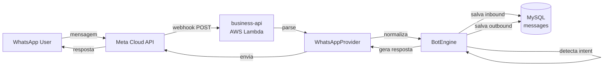
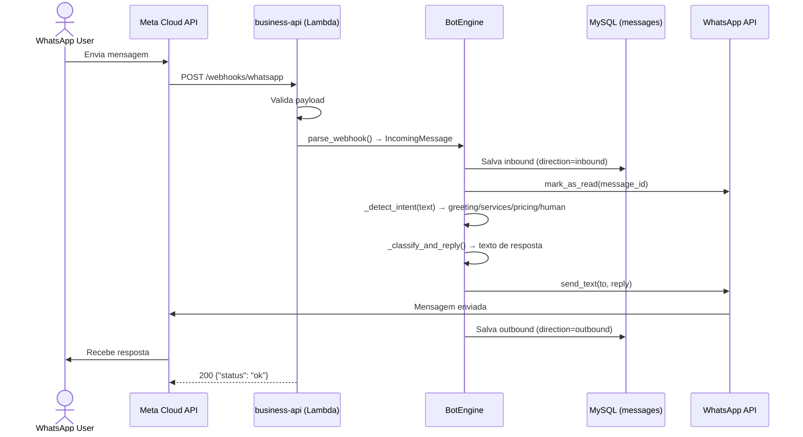

# WhatsApp Business API — BooPixel

Configuração e integração da WhatsApp Cloud API para atendimento automatizado e captação de leads.

---

## Contas e Acessos

| Campo | Valor |
|-------|-------|
| Meta App ID | 945825354522145 |
| Business ID | 2100949430186290 |
| WABA ID | 2693966874336487 |
| Phone Number ID | 1011433038730788 |
| Número | +55 48 8813-5243 |
| PIN 2FA | 482613 |
| Nome exibição | BooPoixel (corrigir pra BooPixel) |
| System User | BooPixel (ID: 61566152353718, Admin) |
| Qualidade | GREEN |
| Limite msgs | TIER_250 |
| Verificação | VERIFIED |

### Credenciais (em ~/.env)

| Variável | Descrição | Status |
|----------|-----------|--------|
| `WHATSAPP_TOKEN` | Token permanente (System User, nunca expira) | ✅ Configurado |
| `WHATSAPP_PHONE_NUMBER_ID` | Phone Number ID (1011433038730788) | ✅ Configurado |
| `WHATSAPP_WABA_ID` | WhatsApp Business Account ID (2693966874336487) | ✅ Configurado |
| `WHATSAPP_APP_ID` | Meta App ID (945825354522145) | ✅ Configurado |
| `WHATSAPP_BUSINESS_ID` | Business Manager ID (2100949430186290) | ✅ Configurado |
| `WHATSAPP_VERIFY_TOKEN` | Webhook verification token (boopixel_webhook_2026) | ✅ Configurado |
| `WHATSAPP_PIN` | PIN de verificação em duas etapas (482613) | ✅ Configurado |

### Onde estão as credenciais

| Local | Variáveis |
|-------|-----------|
| `~/.env` | Todas as variáveis acima |
| `business-api/.env` | WHATSAPP_TOKEN, WHATSAPP_PHONE_NUMBER_ID, WHATSAPP_VERIFY_TOKEN |
| AWS Lambda (business-api-prod) | WHATSAPP_TOKEN, WHATSAPP_PHONE_NUMBER_ID, WHATSAPP_VERIFY_TOKEN |

---

## Status Atual

| Item | Status |
|------|--------|
| App Meta criado | ✅ (945825354522145) |
| Permissões configuradas | ✅ whatsapp_business_management, whatsapp_business_messaging |
| Número registrado | ✅ Verificado (+55 48 8813-5243) |
| Token permanente | ✅ System User "BooPixel" (nunca expira) |
| Envio de mensagens | ✅ Testado (texto + botões interativos) |
| Webhook implementado | ✅ GET/POST /api/v1/webhooks/whatsapp |
| Bot auto-reply | ✅ Intent detection + respostas automáticas |
| Persistência mensagens | ✅ Tabela `messages` criada no banco |
| Deploy produção | ✅ AWS Lambda (business-api-prod) |
| Variáveis no Lambda | ✅ Configuradas |
| Webhook no Meta | ❌ Configurar URL + assinar campos |
| Publicar app Meta | ❌ Necessário pra webhooks de produção |
| Template messages | ❌ Criar e submeter pra aprovação |
| Método pagamento WABA | ❌ Necessário pra mensagens business-initiated |
| Corrigir nome exibição | ❌ BooPoixel → BooPixel |

---

## Arquitetura Implementada

### Visão geral



### Arquitetura de providers (genérica, multi-canal)

```
app/services/messaging/
├── __init__.py
├── base.py           — IncomingMessage, OutgoingMessage, SendResult, MessagingProvider (ABC)
├── bot.py            — BotEngine + BotConfig (genérico, sem canal específico)
└── whatsapp.py       — WhatsAppProvider (implementa MessagingProvider)

app/services/
└── whatsapp_service.py — Facade (exporta provider instance)

app/api/v1/routers/
└── whatsapp.py       — GET (verify) + POST (webhook) em /webhooks/whatsapp

app/models/
└── message.py        — Message model (channel, direction, status, sender, recipient, text)

app/repositories/
└── message_repository.py — get_by_external_id, list_by_sender, list_by_channel
```

### Classes principais

#### `MessagingProvider` (ABC — base.py)

Interface genérica que qualquer canal deve implementar:

```python
class MessagingProvider(ABC):
    channel: str = ""

    def send_text(self, to, message) -> SendResult        # Enviar texto
    def send_buttons(self, to, body, buttons) -> SendResult # Botões interativos
    def mark_as_read(self, message_id) -> None             # Marcar como lido
    def parse_webhook(self, payload) -> list[IncomingMessage] # Parsear webhook
    def send(self, message: OutgoingMessage) -> SendResult   # Envio genérico
```

#### `IncomingMessage` (dataclass — base.py)

Mensagem normalizada de qualquer canal:

| Campo | Tipo | Descrição |
|-------|------|-----------|
| channel | str | "whatsapp", "telegram", "discord" |
| sender | str | Identificador do remetente |
| text | str | Conteúdo da mensagem |
| message_id | str | ID externo original |
| sender_name | str | Nome de exibição |
| raw | dict | Payload original |

#### `BotEngine` (bot.py)

Motor de respostas automáticas, channel-agnostic:

1. Recebe `list[IncomingMessage]`
2. Salva inbound no banco (`messages` table)
3. Detecta intent: greeting, services, pricing, human, unknown
4. Gera resposta baseada no `BotConfig`
5. Envia via provider
6. Salva outbound no banco

#### `BotConfig` (dataclass — bot.py)

Configuração customizável das respostas:

| Campo | Default |
|-------|---------|
| company_name | "BooPixel" |
| company_id | 1 |
| pricing_url | "https://app.boopixel.com/pricing" |
| welcome_message | Saudação + menu 4 opções |
| services_message | Lista de serviços |
| pricing_message | Link pra pricing page |
| human_handoff_message | Encaminha pra equipe |
| default_message | Menu de opções |

#### `WhatsAppProvider` (whatsapp.py)

Implementação do provider pra WhatsApp Cloud API:

| Método | Descrição |
|--------|-----------|
| send_text | Mensagem de texto simples |
| send_buttons | Botões interativos (max 3) |
| send_template | Template message (pode iniciar conversa) |
| send_image | Imagem com legenda |
| send_document | PDF, DOC, etc. |
| mark_as_read | Marcar como lido |
| parse_webhook | Parsear payload do Meta |

### Intent Detection

| Input | Intent | Resposta |
|-------|--------|----------|
| "oi", "olá", "bom dia", etc. | greeting | Menu boas-vindas com 4 opções |
| "1", "site", "landing", "loja" | services | Lista de serviços |
| "2", "plano", "preço", "valor" | pricing | Link pra pricing page |
| "3", "falar", "atendente", "suporte" | human | Encaminha pra equipe |
| Qualquer outra coisa | unknown | Menu com 3 opções |

### Model Message

Tabela `messages` no MySQL:

| Campo | Tipo | Descrição |
|-------|------|-----------|
| id | INT PK | Auto-increment |
| company_id | INT FK | Empresa (scoped) |
| channel | ENUM | whatsapp, telegram, discord, sms |
| direction | ENUM | inbound, outbound |
| sender | VARCHAR(255) | Remetente |
| recipient | VARCHAR(255) | Destinatário |
| text | TEXT | Conteúdo |
| external_id | VARCHAR(255) | ID externo (wamid.xxx) |
| status | ENUM | sent, delivered, read, failed, received |
| sender_name | VARCHAR(255) | Nome de exibição |
| metadata_json | TEXT | Dados extras (JSON) |
| created_at | DATETIME | Timestamp |

---

## Webhook

### Endpoint implementado

```
GET  /api/v1/webhooks/whatsapp  → Verificação (Meta envia challenge)
POST /api/v1/webhooks/whatsapp  → Receber mensagens e status updates
```

### URL de produção

```
https://57ltxkcp4h.execute-api.us-east-1.amazonaws.com/prod/api/v1/webhooks/whatsapp
```

### Configuração no Meta (pendente)

1. Acessar: developers.facebook.com/apps/945825354522145/whatsapp-business/wa-dev-console
2. Na seção **Webhooks** → **Configure Webhooks**
3. **Callback URL:** `https://57ltxkcp4h.execute-api.us-east-1.amazonaws.com/prod/api/v1/webhooks/whatsapp`
4. **Verify Token:** `boopixel_webhook_2026`
5. Assinar campos: `messages`
6. **Publicar o app** pra receber webhooks de produção

### Payload de mensagem recebida

```json
{
  "object": "whatsapp_business_account",
  "entry": [{
    "id": "2693966874336487",
    "changes": [{
      "value": {
        "messaging_product": "whatsapp",
        "metadata": {
          "display_phone_number": "5548881355243",
          "phone_number_id": "1011433038730788"
        },
        "contacts": [{ "wa_id": "5548999897204", "profile": { "name": "Fernando" } }],
        "messages": [{
          "from": "5548999897204",
          "id": "wamid.HBgMNTU0ODk5ODk3MjA0...",
          "timestamp": "1682000000",
          "type": "text",
          "text": { "body": "Olá, quero saber sobre os planos" }
        }]
      }
    }]
  }]
}
```

### Fluxo do webhook



---

## Enviar Mensagem (API)

### Via script CLI

```bash
# Texto
python scripts/whatsapp.py send 5548999897204 "Olá!"

# Template (pode iniciar conversa)
python scripts/whatsapp.py template 5548999897204 lead_welcome pt_BR "João"

# Imagem
python scripts/whatsapp.py image 5548999897204 https://example.com/img.jpg "Legenda"

# Documento
python scripts/whatsapp.py document 5548999897204 https://example.com/doc.pdf "Proposta"

# Botões interativos (max 3)
python scripts/whatsapp.py button 5548999897204 "Escolha:" "Sim,Não,Talvez"

# Lista de opções
python scripts/whatsapp.py list 5548999897204 "Serviços:" "Ver" '[{"title":"Planos","rows":[{"id":"1","title":"Essential"}]}]'

# Info do número
python scripts/whatsapp.py info

# Listar templates
python scripts/whatsapp.py templates

# Marcar como lido
python scripts/whatsapp.py read wamid.xxx
```

### Via curl

```bash
# Texto (janela 24h)
curl -X POST "https://graph.facebook.com/v21.0/1011433038730788/messages" \
  -H "Authorization: Bearer $WHATSAPP_TOKEN" \
  -H "Content-Type: application/json" \
  -d '{"messaging_product":"whatsapp","to":"5548999897204","type":"text","text":{"body":"Olá!"}}'

# Template (iniciar conversa)
curl -X POST "https://graph.facebook.com/v21.0/1011433038730788/messages" \
  -H "Authorization: Bearer $WHATSAPP_TOKEN" \
  -H "Content-Type: application/json" \
  -d '{"messaging_product":"whatsapp","to":"5548999897204","type":"template","template":{"name":"hello_world","language":{"code":"en_US"}}}'
```

---

## Testes Realizados (2026-04-22)

| Teste | Resultado |
|-------|-----------|
| `whatsapp.py info` | ✅ ID, número, nome, qualidade GREEN, TIER_250, VERIFIED |
| `whatsapp.py templates` | ✅ 1 template (hello_world, APPROVED) |
| `whatsapp.py send` texto | ✅ Mensagem recebida no WhatsApp |
| `whatsapp.py button` | ✅ Botões interativos recebidos no WhatsApp |
| Import de todos os módulos | ✅ Model, Repository, Base, Bot, Provider, Router |
| Deploy Lambda | ✅ business-api-prod atualizado |
| Tabela messages criada | ✅ MySQL produção |
| Variáveis no Lambda | ✅ WHATSAPP_TOKEN, PHONE_NUMBER_ID, VERIFY_TOKEN |

---

## Custos

### Preço por conversa (Brasil, 2026)

| Categoria | Preço/conversa | Quando |
|-----------|---------------|--------|
| Marketing | ~$0.0625 | Empresa inicia (promoções, ofertas) |
| Utility | ~$0.0350 | Empresa inicia (notificações, faturas) |
| Authentication | ~$0.0315 | Empresa inicia (OTP, verificação) |
| Service | Grátis | Cliente inicia (primeiras 1.000/mês) |

---

## Como Adicionar Novo Canal

Pra integrar Telegram, Discord ou outro canal:

### 1. Criar provider

```python
# app/services/messaging/telegram.py
class TelegramProvider(MessagingProvider):
    channel = "telegram"

    def send_text(self, to, message) -> SendResult: ...
    def send_buttons(self, to, body, buttons) -> SendResult: ...
    def mark_as_read(self, message_id) -> None: ...
    def parse_webhook(self, payload) -> list[IncomingMessage]: ...
```

### 2. Criar router

```python
# app/api/v1/routers/telegram.py
router_telegram = APIRouter()

@router_telegram.post("")
async def receive_telegram_webhook(request, background_tasks, db):
    provider = TelegramProvider()
    engine = BotEngine(provider=provider, config=BotConfig(), db=db)
    messages = provider.parse_webhook(await request.json())
    if messages:
        background_tasks.add_task(engine.handle, messages)
    return {"status": "ok"}
```

### 3. Registrar

```python
# app/api/v1/routers/__init__.py
from app.api.v1.routers.telegram import router_telegram
v1.include_router(router_telegram, prefix="/webhooks/telegram", tags=["Telegram Webhooks"])
```

Mesma lógica de bot (BotEngine + BotConfig), mesmo banco (messages table), canal diferente.

---

## Como Gerar Token Permanente

1. Acessar: business.facebook.com/settings/system-users/?business_id=2100949430186290
2. Selecionar system user **BooPixel** (ID: 61566152353718)
3. **Generate New Token**
4. Selecionar app **945825354522145**
5. Marcar permissões:
   - ✅ `whatsapp_business_management`
   - ✅ `whatsapp_business_messaging`
6. **Generate Token** → copiar (não aparece de novo!)
7. Atualizar em: `~/.env`, `business-api/.env`, Lambda env vars

> Token permanente **nunca expira** a menos que seja revogado manualmente.

---

## Estratégia de Uso

### Fase 1 — Bot auto-reply (implementado ✅)
- Webhook recebe mensagem → detecta intent → responde automaticamente
- Todas as mensagens salvas no banco (inbound + outbound)
- Intents: saudação, serviços, preços, handoff humano
- Respostas configuráveis via BotConfig

### Fase 2 — Lead capture via WhatsApp (próximo)
- Bot coleta nome, email, empresa durante conversa
- Cria Lead automaticamente no banco ao final do flow
- Admin notificado por email
- Reutilizar form JSON templates do chat web

### Fase 3 — Notificações proativas
- Template de boas-vindas quando chega lead na pricing page
- Lembrete de pagamento antes da fatura vencer
- Confirmação de reunião agendada

### Fase 4 — Agente IA (longo prazo)
- Integrar agente IA treinado com dados da BooPixel
- Atendimento 24/7 automático
- Handoff para humano quando necessário
- Produto vendável: addon AI Agent (R$ 997/mês)

---

## Template Messages (a criar)

Templates precisam de aprovação do Meta antes de usar.

| Nome | Categoria | Conteúdo |
|------|-----------|----------|
| `lead_welcome` | Marketing | "Olá {{1}}! Obrigado pelo interesse na BooPixel. Vamos analisar seu projeto e entrar em contato em breve." |
| `new_lead_admin` | Utility | "Novo lead: {{1}} ({{2}}). Plano: {{3}}. Fonte: {{4}}." |
| `payment_reminder` | Utility | "Olá {{1}}, sua fatura de R$ {{2}} vence em {{3}}. Qualquer dúvida, responda aqui." |
| `appointment_confirm` | Utility | "Reunião confirmada para {{1}} às {{2}}. Link: {{3}}" |

---

## Deploy

### business-api

```bash
cd /Users/fernandocelmer/Lab/BooPixel/business-api
make deploy-prod
```

### Variáveis no Lambda

Atualizadas via AWS CLI:
```bash
aws lambda get-function-configuration --function-name business-api-prod --profile boopixel --query 'Environment.Variables' --output json > /tmp/env.json
# Editar JSON
aws lambda update-function-configuration --function-name business-api-prod --environment file:///tmp/env.json --profile boopixel
```

### Migration

Tabela `messages` criada diretamente no MySQL de produção. Alembic migration disponível em `alembic/versions/a1b2c3d4e5f6_create_messages_table.py`.

---

## Links Úteis

| Recurso | URL |
|---------|-----|
| WhatsApp Dev Console | developers.facebook.com/apps/945825354522145/whatsapp-business/wa-dev-console |
| Business Settings | business.facebook.com/settings/?business_id=2100949430186290 |
| System Users | business.facebook.com/settings/system-users/?business_id=2100949430186290 |
| WhatsApp Manager | business.facebook.com/latest/whatsapp_manager/phone_numbers/?business_id=2100949430186290 |
| Meta Business Inbox | business.facebook.com/latest/inbox |
| Cloud API Docs | developers.facebook.com/docs/whatsapp/cloud-api |
| Pricing | developers.facebook.com/docs/whatsapp/pricing |
| Webhook Produção | 57ltxkcp4h.execute-api.us-east-1.amazonaws.com/prod/api/v1/webhooks/whatsapp |

---

## Decisões Pendentes

- [x] Registrar número (+55 48 8813-5243)
- [x] Gerar token permanente via System User
- [x] Implementar webhook endpoint na business-api
- [x] Implementar bot auto-reply com intent detection
- [x] Criar tabela messages no banco
- [x] Deploy em produção (Lambda + env vars)
- [x] Script CLI (scripts/whatsapp.py)
- [x] Testar envio de texto e botões
- [ ] Configurar webhook URL no Meta (URL + verify token + assinar campos)
- [ ] Publicar app no Meta (necessário pra receber webhooks de produção)
- [ ] Criar e submeter template messages pra aprovação
- [ ] Adicionar método de pagamento na conta WhatsApp Business
- [ ] Corrigir nome de exibição (BooPoixel → BooPixel)
- [ ] Implementar lead capture via conversa WhatsApp
- [ ] Integrar com lead_service (criar Lead no banco a partir de conversa)
- [ ] Dashboard de mensagens no frontend (admin)
