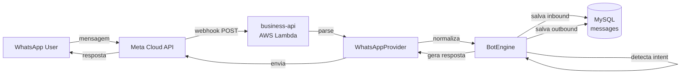
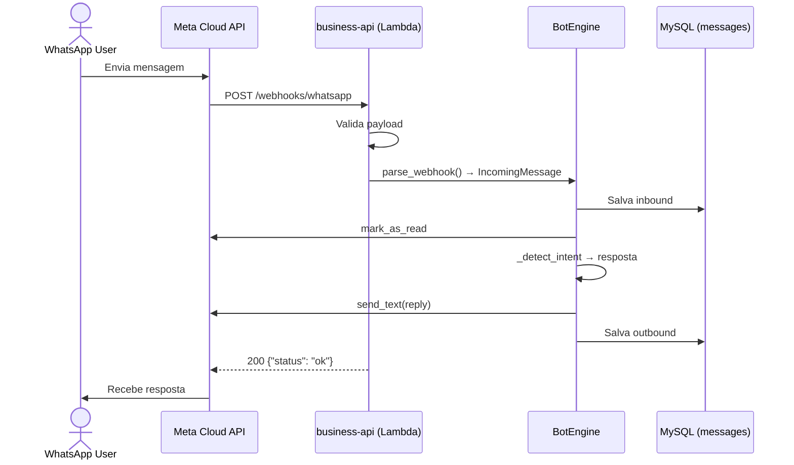
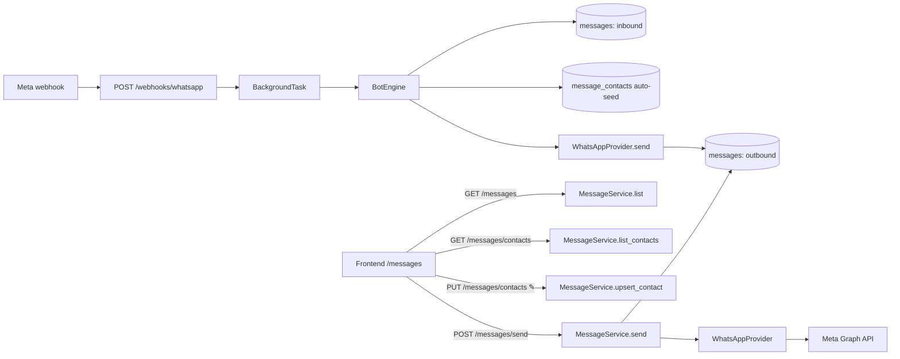
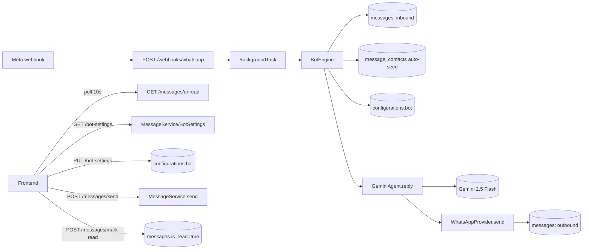

# WhatsApp Business API — BooPixel

Configuração e integração da WhatsApp Cloud API para atendimento automatizado e captação de leads.

---

## Contas e Acessos

| Campo | Valor |
|-------|-------|
| Meta App ID | 945825354522145 |
| Meta App anterior (não usar) | 1747978979524118 |
| Business ID | 2100949430186290 |
| WABA ID | 2693966874336487 |
| Phone Number ID | 1011433038730788 |
| Número | +55 48 8813-5243 |
| PIN 2FA | 482613 |
| Nome exibição | BooPoixel (corrigir pra BooPixel) |
| System User | BooPixel (ID: 61566152353718, Admin) |
| Qualidade | GREEN |
| Limite msgs | TIER_250 |
| Verificação | VERIFIED |

### Credenciais (em ~/.env)

| Variável | Descrição | Status |
|----------|-----------|--------|
| `WHATSAPP_TOKEN` | Token permanente (System User, nunca expira) | ✅ |
| `WHATSAPP_PHONE_NUMBER_ID` | Phone Number ID (1011433038730788) | ✅ |
| `WHATSAPP_WABA_ID` | WhatsApp Business Account ID (2693966874336487) | ✅ |
| `WHATSAPP_APP_ID` | Meta App ID (945825354522145) | ✅ |
| `WHATSAPP_BUSINESS_ID` | Business Manager ID (2100949430186290) | ✅ |
| `WHATSAPP_VERIFY_TOKEN` | Webhook verification token (boopixel_webhook_2026) | ✅ |
| `WHATSAPP_PIN` | PIN de verificação em duas etapas (482613) | ✅ |

### Onde estão as credenciais

| Local | Variáveis |
|-------|-----------|
| `~/.env` | Todas as variáveis acima |
| `business-api/.env` | WHATSAPP_TOKEN, WHATSAPP_PHONE_NUMBER_ID, WHATSAPP_VERIFY_TOKEN |
| AWS Lambda (business-api-prod) | WHATSAPP_TOKEN, WHATSAPP_PHONE_NUMBER_ID, WHATSAPP_VERIFY_TOKEN |

---

## Status Atual

| Item | Status |
|------|--------|
| App Meta criado | ✅ (945825354522145) |
| Permissões | ✅ whatsapp_business_management, whatsapp_business_messaging |
| Número registrado | ✅ Verificado (+55 48 8813-5243) |
| Token permanente | ✅ System User "BooPixel" (nunca expira) |
| Envio de mensagens | ✅ Testado (texto + botões) |
| Webhook implementado | ✅ GET/POST /api/v1/webhooks/whatsapp |
| Bot auto-reply | ✅ Intent detection + respostas automáticas |
| Persistência mensagens | ✅ Tabela `messages` no MySQL |
| Deploy produção | ✅ AWS Lambda (business-api-prod) |
| Variáveis no Lambda | ✅ Configuradas |
| Privacy/Terms pages | ✅ Estáticas em /privacy.html e /terms.html |
| Amplify rewrite rules | ✅ Exceção pra .html estáticos |
| Webhook no Meta | ✅ Verificado + messages assinado |
| Publicar app Meta | ✅ App publicado (Live) |
| Subscribe app à WABA | ✅ POST /subscribed_apps |
| Template messages | ❌ Criar e submeter |
| Método pagamento WABA | ❌ Necessário pra msgs business-initiated |
| Corrigir nome exibição | ❌ BooPoixel → BooPixel |

---

## Problemas Encontrados e Soluções

### 1. Token expirava a cada 24h

**Problema:** Token temporário do Meta expira em 24h, quebrando integração.

**Solução:** Criar System User no Business Manager → gerar token permanente.

**Passo a passo:**
1. business.facebook.com/settings/system-users/?business_id=2100949430186290
2. Add → nome `BooPixel API` → role **Admin** → Create
3. **Add Assets** → Apps → selecionar app 945825354522145 → **Full Control** → Save
4. **Generate New Token** → selecionar app → marcar `whatsapp_business_management` + `whatsapp_business_messaging`
5. Copiar token (não aparece de novo)
6. Atualizar em: `~/.env`, `business-api/.env`, Lambda env vars

### 2. Número já registrado no WhatsApp pessoal

**Problema:** Erro `#2655122` — número já vinculado a conta WhatsApp.

**Solução:** Deletar conta WhatsApp do número no celular → esperar 3 minutos → registrar na API.

**Consequência:** Número perde WhatsApp App (conversas, grupos, etc.). Vira API-only. Responder manualmente via Meta Business Suite Inbox (business.facebook.com/latest/inbox).

### 3. Rate limit no Meta Developer Console

**Problema:** Erro `1647001` — "Limitamos a frequência com que você pode postar". Impedia criar conta de teste e acessar painel.

**Solução:** Esperar (1-24h) ou usar outro browser/aba anônima. Pular teste e ir direto pra produção (Step 2).

### 4. Privacy/Terms URL inválida no Meta

**Problema:** Meta rejeita URLs de SPA (React) porque o crawler não executa JavaScript. Retorna 404 pro Meta mesmo que funcione no browser.

**Solução (3 passos):**

1. Criar arquivos HTML estáticos em `business-frontend/public/`:
   - `public/privacy.html`
   - `public/terms.html`

2. Adicionar ao CopyPlugin do webpack (`webpack.config.js`):
   ```javascript
   { from: "public/privacy.html", to: "privacy.html", noErrorOnMissing: true },
   { from: "public/terms.html", to: "terms.html", noErrorOnMissing: true },
   ```

3. Adicionar exceções no Amplify rewrite rules (via AWS CLI):
   ```bash
   aws amplify update-app --app-id d3s0bfr2lt6dw9 --profile boopixel --custom-rules '[
     {"source":"/privacy.html","target":"/privacy.html","status":"200"},
     {"source":"/terms.html","target":"/terms.html","status":"200"},
     {"source":"/<*>","target":"/index.html","status":"404-200"}
   ]'
   ```

**URLs finais:**
- `https://app.boopixel.com/privacy.html`
- `https://app.boopixel.com/terms.html`

### 5. Template hello_world não funciona com número de produção

**Problema:** Erro `#131058` — "Hello World templates can only be sent from Public Test Numbers".

**Solução:** Template `hello_world` é exclusivo pra números de teste. Pra produção, criar templates próprios e submeter pra aprovação do Meta. Enquanto isso, enviar mensagens de texto (só funciona dentro da janela de 24h após o cliente mandar mensagem primeiro).

### 6. Webhook não recebe mensagens de produção

**Problema:** Webhook configurado mas não recebe mensagens reais — só test webhooks do dashboard.

**Solução:** Publicar o app no Meta. Apps em modo "Development" só recebem webhooks de teste enviados pelo dashboard, não de mensagens reais de usuários.

**Como publicar:**
1. developers.facebook.com/apps/945825354522145/settings/basic/
2. Preencher: Privacy URL (`https://app.boopixel.com/privacy.html`), Terms URL, Categoria
3. Mudar modo do app: Development → Live

### 7. App publicado mas webhook ainda não recebe mensagens

**Problema:** App publicado, webhook verificado, campo `messages` assinado, mas mensagens reais não chegavam no Lambda.

**Solução:** Faltava assinar o app na WABA via API:
```bash
curl -X POST "https://graph.facebook.com/v21.0/$WHATSAPP_WABA_ID/subscribed_apps" \
  -H "Authorization: Bearer $WHATSAPP_TOKEN"
```

Retorna `{"success": true}`. Sem essa chamada, o Meta não roteia mensagens da WABA pro app.

---

## Arquitetura Implementada

### Visão geral



### Arquitetura de providers (genérica, multi-canal)

```
app/services/messaging/
├── __init__.py
├── base.py           — IncomingMessage, OutgoingMessage, SendResult, MessagingProvider (ABC)
├── bot.py            — BotEngine + BotConfig (genérico, canal-agnostic)
└── whatsapp.py       — WhatsAppProvider (implementa MessagingProvider)

app/services/
└── whatsapp_service.py — Facade (exporta provider instance)

app/api/v1/routers/
└── whatsapp.py       — GET (verify) + POST (webhook) em /webhooks/whatsapp

app/models/
└── message.py        — Message model (channel, direction, status enums)

app/repositories/
└── message_repository.py — Queries por external_id, sender, channel
```

### MessagingProvider (ABC)

Interface que qualquer canal deve implementar:

| Método | Descrição |
|--------|-----------|
| `send_text(to, message)` | Enviar texto |
| `send_buttons(to, body, buttons)` | Botões interativos (max 3) |
| `mark_as_read(message_id)` | Marcar como lido |
| `parse_webhook(payload)` | Parsear webhook → `list[IncomingMessage]` |
| `send(message: OutgoingMessage)` | Envio genérico (decide texto ou botão) |

### BotEngine

Motor de respostas automáticas, channel-agnostic:

1. Recebe `list[IncomingMessage]`
2. Salva inbound no banco
3. Detecta intent
4. Gera resposta baseada no `BotConfig`
5. Envia via provider
6. Salva outbound no banco

### BotConfig

| Campo | Default |
|-------|---------|
| company_name | "BooPixel" |
| company_id | 1 |
| pricing_url | "https://app.boopixel.com/pricing" |
| welcome_message | Saudação + menu 4 opções |
| services_message | Lista de serviços |
| pricing_message | Link pra pricing page |
| human_handoff_message | Encaminha pra equipe |
| default_message | Menu de opções |

### Intent Detection

| Input | Intent | Resposta |
|-------|--------|----------|
| "oi", "olá", "bom dia", etc. | greeting | Menu boas-vindas |
| "1", "site", "landing", "loja" | services | Lista de serviços |
| "2", "plano", "preço", "valor" | pricing | Link pricing page |
| "3", "falar", "atendente" | human | Encaminha pra equipe |
| Qualquer outra | unknown | Menu com 3 opções |

### WhatsAppProvider

| Método | Descrição |
|--------|-----------|
| send_text | Mensagem de texto |
| send_buttons | Botões interativos (max 3, label max 20 chars) |
| send_template | Template message (pode iniciar conversa) |
| send_image | Imagem com legenda |
| send_document | PDF, DOC, etc. |
| mark_as_read | Marcar como lido |
| parse_webhook | Parsear payload Meta → IncomingMessage |

### Model Message

Tabela `messages` no MySQL:

| Campo | Tipo | Descrição |
|-------|------|-----------|
| id | INT PK | Auto-increment |
| company_id | INT FK | Empresa (scoped) |
| channel | ENUM | whatsapp, telegram, discord, sms |
| direction | ENUM | inbound, outbound |
| sender | VARCHAR(255) | Remetente |
| recipient | VARCHAR(255) | Destinatário |
| text | TEXT | Conteúdo |
| external_id | VARCHAR(255) | ID externo (wamid.xxx) |
| status | ENUM | sent, delivered, read, failed, received |
| sender_name | VARCHAR(255) | Nome de exibição |
| metadata_json | TEXT | Dados extras (JSON) |
| created_at | DATETIME | Timestamp |

---

## Webhook

### Endpoint

```
GET  /api/v1/webhooks/whatsapp  → Verificação (Meta challenge)
POST /api/v1/webhooks/whatsapp  → Receber mensagens
```

### URL de produção

```
https://57ltxkcp4h.execute-api.us-east-1.amazonaws.com/prod/api/v1/webhooks/whatsapp
```

### Configurar webhook no Meta

1. Acessar: developers.facebook.com/apps/945825354522145/whatsapp-business/wa-dev-console
2. Step 2 → **Configure Webhooks**
3. **Callback URL:** `https://57ltxkcp4h.execute-api.us-east-1.amazonaws.com/prod/api/v1/webhooks/whatsapp`
4. **Verify Token:** `boopixel_webhook_2026`
5. **Verify and Save**
6. Assinar campo: `messages`
7. **Publicar o app** (Development → Live)

### Fluxo do webhook



---

## Script CLI (scripts/whatsapp.py)

```bash
# Texto (janela 24h)
python scripts/whatsapp.py send 5548999897204 "Olá!"

# Template (iniciar conversa)
python scripts/whatsapp.py template 5548999897204 lead_welcome pt_BR "João"

# Imagem
python scripts/whatsapp.py image 5548999897204 https://example.com/img.jpg "Legenda"

# Documento
python scripts/whatsapp.py document 5548999897204 https://example.com/doc.pdf "Proposta"

# Botões (max 3)
python scripts/whatsapp.py button 5548999897204 "Escolha:" "Sim,Não,Talvez"

# Lista
python scripts/whatsapp.py list 5548999897204 "Serviços:" "Ver" '[{"title":"Planos","rows":[{"id":"1","title":"Essential"}]}]'

# Info do número
python scripts/whatsapp.py info

# Listar templates
python scripts/whatsapp.py templates

# Marcar como lido
python scripts/whatsapp.py read wamid.xxx
```

---

## Testes Realizados (2026-04-22)

| Teste | Resultado |
|-------|-----------|
| `whatsapp.py info` | ✅ Qualidade GREEN, TIER_250, VERIFIED |
| `whatsapp.py templates` | ✅ 1 template (hello_world) |
| `whatsapp.py send` texto | ✅ Mensagem recebida |
| `whatsapp.py button` | ✅ Botões interativos recebidos |
| Import todos módulos | ✅ Model, Repository, Base, Bot, Provider, Router |
| Deploy Lambda | ✅ business-api-prod atualizado |
| Tabela messages | ✅ Criada no MySQL |
| Lambda env vars | ✅ Configuradas |
| privacy.html / terms.html | ✅ 200 OK via Amplify |
| Amplify rewrite rules | ✅ Exceção pra .html estáticos |

---

## Custos

| Categoria | Preço/conversa | Quando |
|-----------|---------------|--------|
| Marketing | ~$0.0625 | Empresa inicia (promoções) |
| Utility | ~$0.0350 | Empresa inicia (notificações) |
| Authentication | ~$0.0315 | Empresa inicia (OTP) |
| Service | Grátis | Cliente inicia (1.000/mês grátis) |

---

## Como Adicionar Novo Canal

### 1. Criar provider

```python
# app/services/messaging/telegram.py
class TelegramProvider(MessagingProvider):
    channel = "telegram"
    def send_text(self, to, message) -> SendResult: ...
    def send_buttons(self, to, body, buttons) -> SendResult: ...
    def mark_as_read(self, message_id) -> None: ...
    def parse_webhook(self, payload) -> list[IncomingMessage]: ...
```

### 2. Criar router

```python
# app/api/v1/routers/telegram.py
router_telegram = APIRouter()

@router_telegram.post("")
async def receive_webhook(request, background_tasks, db):
    provider = TelegramProvider()
    engine = BotEngine(provider=provider, config=BotConfig(), db=db)
    messages = provider.parse_webhook(await request.json())
    if messages:
        background_tasks.add_task(engine.handle, messages)
    return {"status": "ok"}
```

### 3. Registrar

```python
# app/api/v1/routers/__init__.py
v1.include_router(router_telegram, prefix="/webhooks/telegram", tags=["Telegram"])
```

Mesma lógica de bot, mesmo banco, canal diferente.

---

## Deploy

### business-api

```bash
cd /Users/fernandocelmer/Lab/BooPixel/business-api
make deploy-prod
```

### Atualizar variáveis no Lambda

```bash
aws lambda get-function-configuration --function-name business-api-prod --profile boopixel \
  --query 'Environment.Variables' --output json > /tmp/env.json
# Editar JSON
aws lambda update-function-configuration --function-name business-api-prod \
  --environment file:///tmp/env.json --profile boopixel
```

### business-frontend (Amplify)

Push pro master dispara deploy automático. Ou manual:
```bash
aws amplify start-job --app-id d3s0bfr2lt6dw9 --branch-name master \
  --job-type RELEASE --profile boopixel
```

### Amplify rewrite rules

```bash
aws amplify update-app --app-id d3s0bfr2lt6dw9 --profile boopixel --custom-rules '[
  {"source":"/privacy.html","target":"/privacy.html","status":"200"},
  {"source":"/terms.html","target":"/terms.html","status":"200"},
  {"source":"/<*>","target":"/index.html","status":"404-200"}
]'
```

---

## Estratégia

### Fase 1 — Bot auto-reply (implementado ✅)
- Webhook recebe mensagem → detecta intent → responde
- Mensagens salvas no banco (inbound + outbound)
- Respostas configuráveis via BotConfig

### Fase 2 — Lead capture via WhatsApp (próximo)
- Bot coleta nome, email, empresa durante conversa
- Cria Lead no banco ao final
- Admin notificado por email
- Reutilizar form JSON templates

### Fase 3 — Notificações proativas
- Template boas-vindas quando chega lead na pricing page
- Lembrete de pagamento
- Confirmação de reunião

### Fase 4 — Agente IA
- IA treinada com dados da BooPixel
- Atendimento 24/7
- Handoff pra humano
- Produto vendável: AI Agent (R$ 997/mês)

---

## Template Messages (a criar e aprovar no Meta)

| Nome | Categoria | Conteúdo |
|------|-----------|----------|
| `lead_welcome` | Marketing | "Olá {{1}}! Obrigado pelo interesse na BooPixel. Vamos analisar seu projeto e entrar em contato em breve." |
| `new_lead_admin` | Utility | "Novo lead: {{1}} ({{2}}). Plano: {{3}}. Fonte: {{4}}." |
| `payment_reminder` | Utility | "Olá {{1}}, sua fatura de R$ {{2}} vence em {{3}}. Qualquer dúvida, responda aqui." |
| `appointment_confirm` | Utility | "Reunião confirmada para {{1}} às {{2}}. Link: {{3}}" |

---

## Commits Realizados

### business-api (9 commits em master)

```
009550d ⚙️ FEATURE: Add WhatsApp Cloud API settings
cc48df9 ⚙️ FEATURE: Add Message model with channel, direction and status enums
a3fa8eb ⚙️ FEATURE: Add MessageRepository with channel and sender queries
02ed587 ⚙️ FEATURE: Add generic messaging provider interface
44caf37 ⚙️ FEATURE: Add channel-agnostic BotEngine with intent detection and DB persistence
a6668fa ⚙️ FEATURE: Add WhatsApp Cloud API messaging provider
63d9e78 ⚙️ FEATURE: Add WhatsApp service facade
4bc53ee ⚙️ FEATURE: Add WhatsApp webhook router at /webhooks/whatsapp
8802f9d ⚙️ FEATURE: Add messages table migration
```

### business-frontend (2 commits em master)

```
27431be ⚙️ FEATURE: Add static privacy and terms pages for Meta app verification
d0c67ae ⚙️ FEATURE: Copy privacy.html and terms.html to build output
```

### boopixel-strategy (commits em master)

```
d8b4e94 📄 DOC: Add WhatsApp CLI script and scripts README
40187f1 📄 DOC: Complete WhatsApp API doc
47ab0ff 📄 DOC: Add WhatsApp 2FA PIN to docs
17b615c 📄 DOC: Add WhatsApp API integration doc
```

---

## Links Úteis

| Recurso | URL |
|---------|-----|
| WhatsApp Dev Console | developers.facebook.com/apps/945825354522145/whatsapp-business/wa-dev-console |
| App Basic Settings | developers.facebook.com/apps/945825354522145/settings/basic/ |
| Business Settings | business.facebook.com/settings/?business_id=2100949430186290 |
| System Users | business.facebook.com/settings/system-users/?business_id=2100949430186290 |
| WhatsApp Manager | business.facebook.com/latest/whatsapp_manager/phone_numbers/?business_id=2100949430186290 |
| Meta Business Inbox | business.facebook.com/latest/inbox |
| Cloud API Docs | developers.facebook.com/docs/whatsapp/cloud-api |
| Pricing | developers.facebook.com/docs/whatsapp/pricing |
| Privacy Page | app.boopixel.com/privacy.html |
| Terms Page | app.boopixel.com/terms.html |
| Webhook Produção | 57ltxkcp4h.execute-api.us-east-1.amazonaws.com/prod/api/v1/webhooks/whatsapp |
| Amplify App ID | d3s0bfr2lt6dw9 |

---

## Decisões Pendentes

- [x] Registrar número (+55 48 8813-5243)
- [x] Gerar token permanente via System User
- [x] Implementar webhook na business-api
- [x] Implementar bot auto-reply com intent detection
- [x] Criar tabela messages no banco
- [x] Deploy em produção (Lambda + env vars)
- [x] Script CLI (scripts/whatsapp.py)
- [x] Testar envio de texto e botões
- [x] Criar privacy.html e terms.html estáticos
- [x] Configurar Amplify rewrite rules
- [x] Configurar webpack CopyPlugin pra .html
- [x] Publicar app Meta (Development → Live)
- [x] Configurar webhook no Meta (URL + verify token + assinar messages)
- [x] Assinar app à WABA (`POST /subscribed_apps`)
- [ ] Criar e submeter template messages pra aprovação
- [ ] Adicionar método de pagamento WABA
- [ ] Corrigir nome exibição (BooPoixel → BooPixel)
- [ ] Implementar lead capture via conversa WhatsApp
- [ ] Integrar com lead_service
- [x] Dashboard de mensagens no frontend (chat estilo WhatsApp)

---

## Atualização 2026-04-23 — Chat UI + envio + contatos editáveis

### Novas funcionalidades

1. **UI estilo WhatsApp** (`/messages` no frontend)
   - Painel esquerdo: lista de contatos (agrupados por "outra parte": `sender` se inbound, `recipient` se outbound), ordenado por msg mais recente
   - Painel direito: thread do contato com bolhas (outbound verde à direita, inbound branco à esquerda)
   - Auto-scroll pro fim da conversa ao abrir/receber msg
   - Avatar com iniciais, busca, badge do canal
   - Tema light/dark totalmente suportado via CSS vars (bolha outbound `#dcf8c6` light / `#1f4d2e` dark)

2. **Envio de mensagens pelo frontend** (admin → cliente)
   - Backend: `POST /api/v1/messages/send` (admin auth)
     - Body: `{recipient, text, channel}` (apenas `whatsapp` por enquanto)
     - Chama `WhatsAppProvider.send()`, persiste outbound com `status=sent` + `external_id`
     - 400 se canal não suportado, 502 se Meta falhar
   - Frontend: textarea no rodapé do chat, Enter envia, Shift+Enter quebra linha
   - ⚠️ Janela 24h do WhatsApp: só aceita texto livre se cliente enviou msg nas últimas 24h — fora disso precisa template approved (não implementado)

3. **Nome customizado do contato** (tabela `message_contacts`)
   - Migration: `b2c3d4e5f6a7_create_message_contacts_table`
   - Colunas: `id`, `company_id`, `channel`, `identifier`, `display_name`, `created_at`, `updated_at`
   - Unique `(company_id, channel, identifier)`
   - Endpoints:
     - `GET /api/v1/messages/contacts` — lista contatos custom da empresa
     - `PUT /api/v1/messages/contacts` — upsert `{channel, identifier, display_name}`
   - Auto-seed: `BotEngine._ensure_contact` cria `MessageContact` automaticamente na primeira mensagem inbound usando o `sender_name` do perfil WhatsApp (profile.name vindo do webhook)
   - Override: se usuário editar pelo ✎ no header do chat, `display_name` custom sobrepõe o profile name

### Arquitetura



### Arquivos novos/alterados

**Backend** (`business-api`):
- `app/models/message_contact.py` — model com `TimestampMixin` + UniqueConstraint
- `app/repositories/message_contact_repository.py` — get + list_by_company
- `app/schemas/message.py` — `MessageSendRequest`, `MessageContactUpsertRequest`, `MessageContactResponse`
- `app/services/message_service.py` — `send`, `list_contacts`, `upsert_contact`
- `app/services/messaging/bot.py` — `_ensure_contact` método
- `app/api/v1/routers/message.py` — `POST /send`, `GET /contacts`, `PUT /contacts` (rotas de `/contacts` antes de `/{message_id}` pra não conflitar com path param)
- `alembic/versions/b2c3d4e5f6a7_create_message_contacts_table.py`

**Frontend** (`business-frontend`):
- `src/pages/admin/messages/index.js` — UI chat, edição inline de nome, auto-scroll
- `src/hooks/useMessages/index.js` — `sendMessage`, `loadContacts`, `saveContact`, estado `contacts`
- `src/assets/theme.css` — classe `.chat-bubble` themed

### Commits

**business-api:**
- `1e459ff` ⚙️ FEATURE: Add POST /messages/send for outbound WhatsApp delivery
- `a72eec2` ⚙️ FEATURE: Editable contact display names with auto-seed from provider profile

**business-frontend:**
- `38c082a` ⚙️ FEATURE: Turn messages page into WhatsApp-style chat with send support
- `0ac7ddb` ⚙️ FEATURE: Polish messages chat — theme fix, auto-scroll, remove channel filter
- `8b8537c` ⚙️ FEATURE: Inline contact name editing in chat header

### Deploy prod (2026-04-23)

- API: `make deploy-prod` → stack `business-api-prod` atualizado
- Alembic: prod estava em `9312122e60dd` mas `messages` já existia → `alembic stamp a1b2c3d4e5f6` + `alembic stamp head`; tabela `message_contacts` já existia (criada pelo SQLAlchemy na inicialização do Lambda), então stamp direto pra `b2c3d4e5f6a7`
- Frontend: push pra master → Amplify deploy automático

### Pendências

- [ ] Template messages pra iniciar conversa fora da janela de 24h
- [ ] Suporte multi-canal real (Telegram, Discord, SMS) — hoje só WhatsApp
- [ ] Unificar com `leads` (converter mensagem WhatsApp em lead)
- [x] Notificação quando nova mensagem chega (push/badge)

---

## Atualização 2026-04-23 (parte 2) — Unread, notificações, responsivo e bot de IA

### 1. Tracking de não lidas + sino de notificações

**Backend:**
- Coluna `messages.is_read` (bool, default false). Outbound existentes → `true` no backfill
- Endpoint `GET /api/v1/messages/unread` → `{total, items[]}` agrupado por contato com preview e contagem
- Endpoint `POST /api/v1/messages/mark-read` body `{channel, sender}` marca conversa toda como lida
- Rotas ordenadas antes de `/{message_id}` pra evitar conflito de path param

**Frontend:**
- `NotificationsContext` global (mount em `src/index.js` dentro do `AuthProvider`)
  - Polling 10s (pausa quando aba oculta, refetch imediato ao voltar)
  - Estado global: `{total, items, refresh, markContactRead}`
  - Title da aba: `(N) BooPixel` estático; ao chegar msg nova com aba oculta → pisca `🔔 (N) BooPixel` até voltar pra aba
  - Notificação nativa do SO quando permissão concedida (request automático no 1º load)
- Sino no `AppHeader` com badge vermelho (contador `99+`) e dropdown com últimos 8 contatos, clicar navega `/messages?contact=X&channel=Y` + mark-read otimista
- Página `/messages` lê query string e seleciona contato; ao abrir conversa, marca inbound não lidas

### 2. Responsividade da tela de chat

**CSS** (`src/assets/theme.css`):
- Classe `messages-layout` com breakpoint 768px
- Desktop: sidebar 340px + chat side-by-side
- Mobile: só sidebar visível; ao selecionar contato, swap pra chat com botão ← voltar
- `has-active` class toggla os painéis via `display`

### 3. Bot de IA com Gemini (v1)

**Dep:**
- `google-genai ^1.0.0` nos 4 arquivos obrigatórios (pyproject, lock, requirements.txt, requirements-lambda.txt)

**Settings** (`app/core/settings.py`):
- `gemini_api_key` — chave da Google AI Studio
- `gemini_model` (default `gemini-2.5-flash`)
- `llm_enabled` (kill switch global)

**Agent** (`app/services/ai/gemini_agent.py`):
- `GeminiAgent.reply(history, current_text, config)` monta `contents` com papéis `user`/`model` a partir dos `Message` do DB
- `DEFAULT_SYSTEM_PROMPT` — persona BooPixel, serviços, regras ("nunca inventar preço", "escalar se não souber"), `temperature=0.7`, `max_output_tokens=500`
- Fallback: se API falhar (timeout, quota, erro) → loga e cai no template keyword matching

**BotEngine** (`app/services/messaging/bot.py`):
- Carrega histórico via `message_repository.list_conversation(company_id, channel, contact, limit=21)` (ambas direções, desc → reversed)
- Filtra msg corrente pra não duplicar
- `_load_settings()` lê da `configurations` key `bot` (ver tabela genérica abaixo); fallback pros defaults

### 4. Tabela genérica `configurations`

Substitui `bot_settings` (dropada). Projetada pra outras configs futuras do sistema.

| Campo | Tipo | Descrição |
|-------|------|-----------|
| `id` | INT PK | |
| `company_id` | INT FK → companies | |
| `key` | VARCHAR(128) | Nome da config (ex: `bot`) |
| `value` | TEXT | JSON serializado |
| `created_at`, `updated_at` | DATETIME | |

Unique `(company_id, key)`.

**Uso atual:**
- Key `bot`: `{"system_prompt": "...", "enabled": true, "model": "gemini-2.5-flash"}`

**Migrations:**
- `d4e5f6a7b8c9_create_bot_settings_table.py` (criada, depois descartada)
- `e5f6a7b8c9d0_create_configurations_tables.py` — cria `configurations`, copia `bot_settings` → `configurations.key='bot'` (JSON), dropa `bot_settings`

Prod ficou com `configuration_types` órfã (experimento two-table descartado) — foi dropada manualmente.

### 5. Tela `/bot` — Prompt IA editável

**Backend** (`app/api/v1/routers/bot_settings.py`):
- `GET /api/v1/bot-settings` — retorna settings atuais (ou defaults)
- `PUT /api/v1/bot-settings` body `{system_prompt, enabled, model}` — upsert na `configurations.bot`
- Service `bot_settings_service.py` só embrulha `ConfigurationRepository` com serialização JSON

**Frontend:**
- Hook `src/hooks/useBotSettings/index.js` — `load`, `save`
- Página `src/pages/admin/bot/index.js` no padrão Company: DashboardLayout → Alerts → Card → Form (toggle enabled, select modelo, textarea prompt)
- View wrapper `src/views/BotSettings.js`, rota `/bot` em `src/app.js`
- Sidebar: item "Mensagens" vira dropdown com submenu Mensagens + Prompt IA
- Ícone Bot (lucide)

### 6. SAM template — env vars gerenciadas

Adicionados ao `template.yaml` e `samconfig.toml` (dev + prod):
- `GeminiApiKey` (NoEcho), `GeminiModel`
- `WhatsappToken` (NoEcho), `WhatsappPhoneNumberId`, `WhatsappVerifyToken`

Antes essas envs eram setadas manualmente no console da Lambda; agora são declarativas via CloudFormation.

### Arquitetura (atualizada)



### Commits

**business-api:**
- `64f1b0b` ⚙️ FEATURE: Unread message tracking with per-conversation mark-read endpoint
- `1d4c013` ⚙️ FEATURE: Gemini-backed bot replies with per-company configurable prompt
- `0a02054` ⚙️ FEATURE: Wire Gemini and WhatsApp env vars into SAM template

**business-frontend:**
- `e5ad798` ⚙️ FEATURE: Bell notifications, tab title flash and responsive chat layout
- `78f3cbf` ⚙️ FEATURE: Bot settings page under Messages submenu

### Deploy prod

- Migrations stampadas (tabelas auto-criadas pelo SQLAlchemy impedem DDL do alembic): `c3d4e5f6a7b8` (is_read), `d4e5f6a7b8c9` (bot_settings — descartada), `e5f6a7b8c9d0` (configurations)
- Data migration manual em prod: `bot_settings` → `configurations.bot` (1 row company_id=2), depois `DROP TABLE bot_settings`
- Órfã `configuration_types` dropada manualmente
- 2 deploys `make deploy-prod` — primeiro subiu código + dep `google-genai`, segundo aplicou env vars via template atualizado

### Pendências

- [ ] Tool use do Gemini — bot chama `create_lead`, `get_pricing`, `schedule_handoff` como funções
- [ ] Flag `bot_paused` em `message_contacts` pra admin assumir conversa manual
- [ ] Grounding RAG com docs de serviços/preços
- [ ] Structured output `{reply, escalate, lead_data}` pra capturar sinais
- [ ] Status real dos outbound (delivered/read via `statuses[]` do webhook) — hoje trava em `sent`
- [ ] Tela de Configurations genérica (CRUD de qualquer `key`) pra não precisar criar tela por feature
